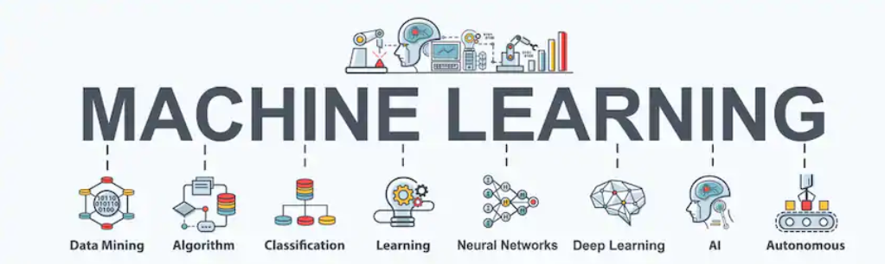

# AI and Machine Learning

# Notes

Below are notes on various topics as I learn all things AI. These notes are updated as I learn more on the topic. My raw notes are a mixture of markdown and LaTeX so will need an editor such as [Typora](https://typora.io/). Below are the same notes in PDF format.

## Linear Regression

* [Univariate Linear Regression](notes/pdf/1-1-univariate-linear-regression.pdf)
* [Gradient Descent](notes/pdf/1-2-gradient-descent.pdf)
* [Pseudo Inverse](notes/pdf/1-3-pseudo-inverse.pdf)
* [Multivariate Linear Regression](notes/pdf/1-4-multivariate-linear-regression.pdf)

## Logistic Regression

* [Logistic Regression](notes/pdf/4-0-logistic-regrsssion.pdf)
* [Binary Logistic Regression](notes/pdf/4-1-logistic-regression-binary.pdf)
* [Multiclass Logistic Regression](notes/pdf/4-2-logistic-regression-multiclass.pdf)
* [Logistic Regression Vectorization](notes/pdf/4-3-logistic-regression-vectorization.pdf)

## Neural Networks

* [Introduction](notes/pdf/6-0-neural-networks.pdf)
* [Types of Neural Networks](notes/pdf/6-1-types-of-neural-networks.pdf)
* [Forward Propagation](notes/pdf/6-05-nn-forward-propagation.pdf)
* [Classification and Cost](notes/pdf/6-10-nn-classification-and-cost.pdf)
* [Activation Functions](notes/pdf/6-30-nn-activation-functions.pdf)
* [Logic Gates](notes/pdf/6-40-nn-logic-gates.pdf)
* [Back Propagation](notes/pdf/6-50-nn-back-propagation.pdf)
* [Gradient Checking](notes/pdf/6-55-nn-gradient-checking.pdf)
* [Parameter Initialization](notes/pdf/6-20-nn-parameter-init.pdf)
* [Unrolling Parameters](notes/pdf/6-25-nn-unrolling-parameters.pdf)
* [Architecting a Basic Neural Network](notes/pdf/6-60-nn-architect-neural-network.pdf)
* [Training a Neural Network](notes/pdf/6-65-training-nn.pdf)

## Feature Engineering

* [Feature Scaling](notes/pdf/2-0-fe-feature-scaling.pdf)
* [Regularization](notes/pdf/5-0-fe-regularizaion.pdf)
* [Encoding](notes/pdf/6-21-nn-encoding.pdf)

## Other

* [Important People in the Field of AI](notes/pdf/100-important-people.pdf)

# Notebooks

As I study a topic I will create a notebook to apply concepts. Below are various notebooks on some of the topics above.

* [Univariate Linear Regression](https://nbviewer.jupyter.org/github/harperd/machine-learning/blob/master/notebooks/univariate-linear-regression.ipynb)
* [Multivariate Linear Regression](https://nbviewer.jupyter.org/github/harperd/machine-learning/blob/master/notebooks/multivariate-linear-regression.ipynb)
* [Binary Logistic Regression](https://nbviewer.jupyter.org/github/harperd/machine-learning/blob/master/notebooks/binary-logistic-regression.ipynb)
* [Multiclass Logistic Regression](https://nbviewer.jupyter.org/github/harperd/machine-learning/blob/master/notebooks/multiclass-logistic-regression.ipynb)
* [Neural Network](https://nbviewer.jupyter.org/github/harperd/machine-learning/blob/master/notebooks/neural-network.ipynb)
* [K-Means Clustering](https://nbviewer.jupyter.org/github/harperd/machine-learning/blob/master/notebooks/clustering-kmeans.ipynb)
* [K-Means Cluster Distance](https://nbviewer.jupyter.org/github/harperd/machine-learning/blob/master/notebooks/cluster-distance.ipynb)
* [Data Visualization](https://nbviewer.jupyter.org/github/harperd/machine-learning/blob/master/notebooks/data-visualization.ipynb)

# Computational Thinking and Data Science

My notes from the MIT [Introduction to Computational Thinking and Data Science](https://ocw.mit.edu/courses/electrical-engineering-and-computer-science/6-0002-introduction-to-computational-thinking-and-data-science-fall-2016/) course are [here](notes/pdf/99-2-comp-thinking-data-science.pdf).

## K-Means Clustering From Scratch

This was part of the MIT course and the full source can be found [here](/python/kmeans).

# Math Refreshers

* [Linear Algebra - Vectors](notes/pdf/88-1-linear-algebra-vectors.pdf)
* [Linear Algebra - Matrices](notes/pdf/88-2-linear-algebra-matrices.pdf)
* [Calculus - Derivatives](notes/pdf/99-2-calculus-derivative.pdf)
