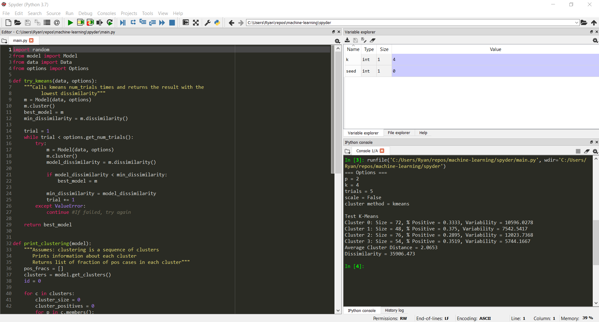

# AI and Machine Learning

# Notes

Below are notes on various topics as I learn all things AI. These notes are updated as I learn more on various topics around machine learning and AI in general. My raw notes are a mixture of markdown and LaTeX so will need an editor such as [Typora](https://typora.io/). Below are the same notes in PDF format.

* [Univariate Linear Regression](notes/pdf/1-1-univariate-linear-regression.pdf)
* [Gradient Descent](notes/pdf/1-1-univariate-linear-regression.pdf)
* [Pseudo Inverse](notes/pdf/1-3-pseudo-inverse.pdf)
* [Multivariate Linear Regression](notes/pdf/1-4-multivariate-linear-regression.pdf)
* [Feature Scaling](notes/pdf/2-0-feature-scaling.pdf)
* [Logistic Regression](notes/pdf/4-0-logistic-regrsssion.pdf)
* [Binary Logistic Regression](notes/pdf/4-1-logistic-regression-binary.pdf)
* [Multiclass Logistic Regression](notes/pdf/4-2-logistic-regression-multiclass.pdf)
* [Logistic Regression Vectorization](notes/pdf/4-3-logistic-regression-vectorization.pdf)
* [Regularization](notes/pdf/5-0-regularizaion.pdf)
* [Nerual Networks](notes/pdf/6-0-neural-networks.pdf)
* [Nerual Networks - Forward Propagation](notes/pdf/6-05-forward-propagation.pdf)
* [Nerual Networks - Classification and Cost](notes/pdf/6-10-classification-and-cost.pdf)
* [Nerual Networks - Activation Functions](notes/pdf/6-30-activation-functions.pdf)
* [Logic Gates](notes/pdf/6-40-logic-gates.pdf)
* [Back Propagation](notes/pdf/6-50-back-propagation.pdf)

# Notebooks

As I study a topic I will create a notebook to apply concepts. Below are various notebooks on some of the topsic above.

* [Univariate Linear Regression](notebooks/univariate-linear-regression.ipynb)
* [Multivariate Linear Regression](notebooks/multivariate-linear-regression.ipynb)
* [Binary Logistic Regression](notebooks/binary-logistic-regression.ipynb)
* [Multiclass Logistic Regression](notebooks/multiclass-logistic-regression.ipynb)
* [Neural Network](notebooks/neural-network.ipynb)
* [K-Means Clustering](notebooks/clustering-kmeans.ipynb)
* [K-Means Cluster Distance](notebooks/cluster-distance.ipynb)
* [Data Visualization](notebooks/data-visualization.ipynb)

# K-Means Clustering from Scratch

Source [here](/spyder)

# Math Refreshers

* [Linear Algebra - Basics](notes/pdf/99-0-linear-algebra.pdf)
* [Calculus - Derivatives](notes/pdf/99-2-calculus-derivative.pdf)
