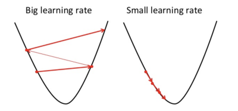

# Univariate Linear Regression

Unlike *multivariate* linear regression, *univariate* is when we are only working with a single feature. This is the simplest form of supervised machine learning where we only have a single *feature*, or $x$ value. Linear regression is about finding a line that best intersects a set of data (features). 

We will graph our line by using the very simple slope-intercept function shown below where *b* is the y-intercept and *m* is the slope of the line.

> $y\ =\ mx\ +\ b$

In machine learning, this is called our *hypothesis* function as shown below where theta ($\theta$) can represent any two numbers and $h_\theta(x)$ or $y$ is our *prediction*. We just have to figure out what those two numbers are that allow the function to best intersect our data or features. Below is how our hypothesis is formally written. It's a simple linear equation but finding the best theta values is where the challenge lies.

> $h_{\theta }( x) =\theta _{0} \ +\ \theta _{1} x$

## Cost Function: Choosing Theta

In supervised learning we have a *training set* of data that is used to train our model $h_{\theta }( x) =\theta _{0} \ +\ \theta _{1} x$ where $x$ is a feature value from our training set and our predicted $y$ value is the result of our function $h_{\theta }( x)$. Our predicted $y$ value is then compared against the $y$ values from our training set (the correct predictions) to measure how accurate, or *fit*, our model is. Again, we need to find the best values for $\theta _{0}$ and $\theta _{1}$ to optimize our model. We want a good *fit* of the model where the difference between *$h_{\theta }( x)$* and our training set, $y$ values, are minimized. 

In the illustration below, our hypothesis function $h_{\theta }( x)$ is plotted along the blue line. The distance, or model *fitness*, is measured between our training data points and the result of our linear function, *$h_{\theta }( x)$*.

We can choose good theta values by using the *Cost Function* denoted as $J(\theta_{0}, \theta_{1})$ where  $\theta_{0}$, and $\theta_{1}$ points on the $x$,$y$ axis and $J(\theta_{0}, \theta_{1})$ is *z*. This is also called the *Squared Error Function* which is the most commonly used for linear regression problems. Here, we want to get the results of our cost function as close to zero as possible by trying different values for $\theta _{0}$ and $\theta _{1}$.

> $\large J( \theta _{0} ,\ \theta _{1}) =\frac{1}{2m}\sum\limits ^{m}_{i=1}\left( h_{\theta }\left( x^{( i)}\right) -y^{( i)}\right)^{2}$

> **Note:** Multiplying the result by $\frac{1}{2m}$ is purely for aesthetics.

> **Note:** You will notice the *Sum of Squared Errors* used in many other equations used to measure cost or optimization. This is the part of the equation that measures the difference between your predicted $y$ and the $y$ of your training set as denoted by $(y_{1} - y_{2})^2$ Squaring the value just makes it easier to work with.

In the _Cost Function_ above you will notice the result of our *hypothesis* function, $h_{\theta }\left( x^{( i)}\right)$, subtracted by our training set $y^{( i)}$. This is the heart of the cost function where want to minimize the distance between our hypothesis and training values. We do this for the entire set of data, $\sum\limits ^{m}_{i=1}$.

### Cost Function Visualization

When you plot a range of different values for $\theta_{0}$ and $\theta_{1}$ you will get a 3-D plot similar to the image below. Since this is linear regression (a single line) there will only be a single optimal value for each theta hence the graph will always result in a bow shape with a single global minimum at the bottom of the bow. Hence, the cost function $J(\theta_{0}, \theta_{1})$, is known as a *convex function*.

The graph below is indicative of a *non-linear function* with multiple, or local, minimums. In either graph, the values for $\theta_{0}$ and $\theta_{1}$ are at the lowest point on the graph. The theta values at the minimum on the graph minimize the $J(\theta_{0}, \theta_{1})$ function which achieves our goal of finding the best fit for our model.

> **See Also:** [mplot3d Toolkit](https://matplotlib.org/tutorials/toolkits/mplot3d.html)

The Cost Function can be more easily understood by using a 2-D *Contour Plot*, shown below on the right, where the minimal theta values would lie somewhere near the center circle. The graph on the left shows what our hypothesis function, $h_{\theta }\left( x^{( i)}\right)$, looks like with the optimal theta values directly intersecting our feature data.

> **See Also:** [Contour Plot with Matplotlib](https://matplotlib.org/api/_as_gen/matplotlib.pyplot.contour.html)

> **See Also:** [Contour Plot demo with Matplotlib](https://matplotlib.org/gallery/images_contours_and_fields/contour_demo.html)

## Gradient Descent: Automating the Cost Function

*Gradient Descent* is an algorithm used to find the optimal or minimized $J(\theta_{0}, \theta_{1})$. Sometimes it is referred to as *Batch Gradient Descent* because it is iterating over all training examples.

> $\large \theta_{j}\ := \theta_{j}-\alpha\frac{\partial}{\partial\theta_{j}}J(\theta_{0},\theta_{1})$

> **Note:** The function uses an *assignment* operator $:=$ instead of an *equality* operator $=$ which means that $\theta_{j}$ is not *equal* to the right hand side of the equation but *set* to the result of the equation.

Here, $\alpha$ (alpha) is the learning rate or step. The smaller the step the slower the algorithm will run. The larger, the faster. However, if alpha is too large you may not get to the lowest theta values since the algorithm may overshoot the minimum. 

The derivative expression, $\frac{\partial}{\partial\theta_{j}}J(\theta_{0},\theta_{1})$, measures the rate of change. The *derivative* just measures the *slope* of a line (rise over run or x over y) that is *tangent* to or next to a point within of a graphed function. Here, $\partial$ (partial derivative) is a just a mathematical term which means that it the function works with multiple variables contrasted to $d$ (derivative) which is used with single variable functions. 

### Moving Toward Minimum

The derivative can be sloped in a positive direction on the $x,y$ axis (going from lower left to upper right) which denotes a *positive derivative* as shown in the illustration below. This derivative (positive, negative, or zero) tells the Gradient Descent algorithm which way to move (step next) with respect to the graphed function (shown as the green line in the graph below) in order to seek the minimum of $J(\theta_{0},\theta_{1})$.

If the result of the derivative, $\frac{\partial}{\partial\theta_{j}}J(\theta_{0},\theta_{1})$, is a *positive number* then the equation looks like the below which moves the Gradient Decent algorithm to the *left* on the graph moving it closer to the minimum. Here $\theta_{1}$ is on the $x$ axis and the result would yield an $x$ value to the left of the starting $x$ value which moves closer to the minimum of our function $h_{\theta}(x)$.

> $\large \theta_{1} := \theta_{1} - \alpha(+\partial)$

As Gradient Descent approaches the minimum, the rate of change will become increasingly smaller. Hence, the algorithm will slow as it approaches the local minimum and ultimately stop changing once it has reached the minimum so there is not need to decrease the value of alpha.

### Simultaneous Compute

What *Gradient Descent* algorithm does is *simultaneously* compute values for $\theta_{0}$ and $\theta_{1}$. What is meant by *simultaneously* is represented in the pseudo code below where $\theta_{0}$ and $\theta_{1}$ are assigned new values at the same time. In other words, if $\theta_{0}$ was set ($\theta_{0} :=$ *temp0*) *before* temp1 was set (*temp1* $:= \theta_{1}-\alpha\frac{\partial}{\partial\theta_{1}}J(\theta_{0},\theta_{1})$) then it would affect the results of temp1 and yield incorrect results. We want to repeat this series of steps until we reach *convergence* or $\theta_{0}$ and $\theta_{1}$ are at their minimum.

> *repeat until convergence {*
>
> ​    $temp0 := \theta_{0}-\alpha\frac{\partial}{\partial\theta_{0}}J(\theta_{0},\theta_{1})$
>
> ​	$temp1 := \theta_{1}-\alpha\frac{\partial}{\partial\theta_{1}}J(\theta_{0},\theta_{1})$
>
> ​	$\theta_{0} := temp0$
>
> ​	$\theta_{1} := temp1$
>
> *}* 

Finding the partial derivatives of the expression $\alpha\frac{\partial}{\partial\theta_{1}}J(\theta_{0},\theta_{1})$ with respect to $\theta_{0}$ and $\theta_{1}$ yields the below:

> *repeat until convergence {* 
>
> ​	$temp 0:= \theta_{0}-\alpha\frac{1}{m}\sum\limits ^{m}_{i=1}\left( h_{\theta }\left( x^{(i)}\right) -y^{( i)}\right)$
>
> ​	$temp1 := \theta_{0}-\alpha\frac{1}{m}\sum\limits ^{m}_{i=1}\left( h_{\theta }\left( x^{(i)}\right) -y^{( i)}\right)\cdot x^{(i)}$
>
> ​	$\theta_{0} := temp0$
>
> ​	$\theta_{1} := temp1$
>
> *}* 

## Hypothesis Calculation Using Matrices

When applying a large set of features to a hypothesis function it is more computationally efficient to use matrices instead of a looping construct to compute the predictions for each feature. For example, in *univariate* regression with 3 features, using matrices, a hypothesis can be computed as below.

If  our values for $\theta _{0}$ and $\theta _{1}$ are $-40$ and $0.25$ respectively then our hypothesis would look like:

> $h_{\theta }( x) =-40 + 0.25x$

Given a set of features (5, 2 and 4) we can construct a matrix with the first column only containing the value $1$ since it is not multiplied by a feature.

> $\begin{bmatrix}1&5\\1&2\\1&4\end{bmatrix}$

Using matrix multiplication we can then apply each feature in our matrix to our hypotheses function:

> $\begin{bmatrix}1&5\\1&2\\1&4\end{bmatrix}\cdot\begin{bmatrix}-40\\0.25\end{bmatrix}=\begin{bmatrix}(1\cdot-40)+(5\cdot0.25)\\(1\cdot-40)+(2\cdot0.25)\\(1\cdot-40)+(4\cdot0.25)\end{bmatrix}=\begin{bmatrix}-38.75\\-39.50\\-40\end{bmatrix}$

### Competing Hypothesis

Matrix multiplication can be use to execute multiple hypothesis functions at the same time with a set of features in an efficient manner.

> $h_{\theta }( x) =-40 + 0.25x$
>
> $h_{\theta }( x) =200 + 0.1x$
>
> $h_{\theta }( x) =-150 + 0.4x$

> $\begin{bmatrix}1&2104\\1&1416\\1&1534\\1&852\end{bmatrix}\cdot\begin{bmatrix}-40&200&-150\\0.25&0.1&0.4\end{bmatrix}=\begin{bmatrix}486&410&692\\314&342&416\\344&353&464\end{bmatrix}$