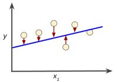

# Univariate Linear Regression

Unlike *multivariate* linear regression, *univariate* is when we are only working with a single feature. This is the simplest form of supervised machine learning where we only have a single *feature*, or $x$ value. Linear regression is about finding a line that best intersects a set of data (features). 

We will graph our line by using the very simple slope-intercept function shown below where *b* is the y-intercept and *m* is the slope of the line.

> $y\ =\ mx\ +\ b$

In machine learning, this is called our *hypothesis* function as shown below where theta ($\theta$) can represent any two numbers and $h_\theta(x)$ or $y$ is our *prediction*. We just have to figure out what those two numbers are that allow the function to best intersect our data or features. Below is how our hypothesis is formally written. It's a simple linear equation but finding the best theta values is where the challenge lies.

> $h_{\theta }( x) =\theta _{0} \ +\ \theta _{1} x$

## Cost Function: Choosing Theta

In supervised learning we have a *training set* of data that is used to train our model $h_{\theta }( x) =\theta _{0} \ +\ \theta _{1} x$ where $x$ is a feature value from our training set and our predicted $y$ value is the result of our function $h_{\theta }( x)$. Our predicted $y$ value is then compared against the $y$ values from our training set (the correct predictions) to measure how accurate, or *fit*, our model is. Again, we need to find the best values for $\theta _{0}$ and $\theta _{1}$ to optimize our model. We want a good *fit* of the model where the difference between *$h_{\theta }( x)$* and our training set, $y$ values, are minimized. 

In the illustration below, our hypothesis function $h_{\theta }( x)$ is plotted along the blue line. The distance, or model *fitness*, is measured between our training data points and the result of our linear function, *$h_{\theta }( x)$*.

We can choose good theta values by using the *Cost Function* denoted as $J(\theta_{0}, \theta_{1})$ where  $\theta_{0}$, and $\theta_{1}$ points on the $x$,$y$ axis and $J(\theta_{0}, \theta_{1})$ is *z*. This is also called the *Squared Error Function* which is the most commonly used for linear regression problems. Here, we want to get the results of our cost function as close to zero as possible by trying different values for $\theta _{0}$ and $\theta _{1}$.

> $J( \theta _{0} ,\ \theta _{1}) =\frac{1}{2m}\sum\limits ^{m}_{i=1}\left( h_{\theta }\left( x^{( i)}\right) -y^{( i)}\right)^{2}$

> **Note:** Multiplying the result by $\frac{1}{2m}$ is purely for aesthetics.

> **Note:** You will notice the *Sum of Squared Errors* used in many other equations used to measure cost or optimization. This is the part of the equation that measures the difference between your predicted $y$ and the $y$ of your training set as denoted by $(y_{1} - y_{2})^2$ Squaring the value just makes it easier to work with.

In the _Cost Function_ above you will notice the result of our *hypothesis* function, $h_{\theta }\left( x^{( i)}\right)$, subtracted by our training set $y^{( i)}$. This is the heart of the cost function where want to minimize the distance between our hypothesis and training values. We do this for the entire set of data, $\sum\limits ^{m}_{i=1}$.

### Cost Function Visualization

When you plot a range of different values for $\theta_{0}$ and $\theta_{1}$ you will get a 3-D plot similar to the image below. Since this is linear regression (a single line) there will only be a single optimal value for each theta hence the graph will always result in a bow shape with a single global minimum at the bottom of the bow. Hence, the cost function $J(\theta_{0}, \theta_{1})$, is known as a *convex function*.

The graph below is indicative of a *non-linear function* with multiple, or local, minimums. In either graph, the values for $\theta$ are at the lowest point on the graph. The theta values at the minimum on the graph minimize the $J(\theta_{0}, \theta_{1})$ function which achieves our goal of finding the best fit for our model.

> **See Also:** [mplot3d Toolkit](https://matplotlib.org/tutorials/toolkits/mplot3d.html)

The Cost Function can be more easily understood by using a 2-D *Contour Plot*, shown below on the right, where the minimal theta values would lie somewhere near the center circle. The graph on the left shows what our hypothesis function, $h_{\theta }\left( x^{( i)}\right)$, looks like with the optimal theta values directly intersecting our feature data.

> **See Also:** [Contour Plot with Matplotlib](https://matplotlib.org/api/_as_gen/matplotlib.pyplot.contour.html)

> **See Also:** [Contour Plot demo with Matplotlib](https://matplotlib.org/gallery/images_contours_and_fields/contour_demo.html)
