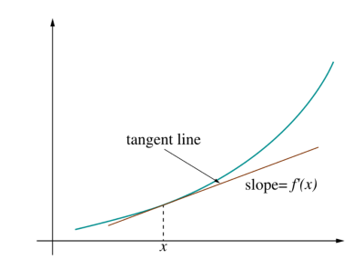

# Gradient Descent: Automating the Cost Function

*Gradient Descent* is an algorithm used to find the optimal or minimized $J(\theta_{0}, \theta_{1})$. Sometimes it is referred to as *Batch Gradient Descent* because it is iterating over all training examples.

> $\theta_{j}\ := \theta_{j}-\alpha\frac{\partial}{\partial\theta_{j}}J(\theta_{0},\theta_{1})$

> **Note:** The function uses an *assignment* operator $:=$ instead of an *equality* operator $=$ which means that $\theta_{j}$ is not *equal* to the right hand side of the equation but *set* to the result of the equation.

Here, $\alpha$ (alpha) is the *learning rate* or *step*. The smaller the step the slower the algorithm will run. The larger, the faster. However, if alpha is too large you may not get to the lowest theta values since the algorithm may overshoot the minimum. 


The derivative expression, $\frac{\partial}{\partial\theta_{j}}J(\theta_{0},\theta_{1})$, measures the rate of change. The *derivative* just measures the *slope* of a line (rise over run or y over x) that is *tangent* to or next to a point within of a graphed function. Here, $\partial$ (partial derivative) is a just a mathematical term which means that it the function works with multiple variables contrasted to $d$ (derivative) which is used with single variable functions. 

## Moving Toward Minimum

The derivative can be sloped in a positive direction on the $x,y$ axis (going from lower left to upper right) which denotes a *positive derivative* as shown in the illustration below. This derivative (positive, negative, or zero) tells the Gradient Descent algorithm which way to move (step next) with respect to the graphed function (shown as the green line in the graph below) in order to seek the minimum of $J(\theta_{0},\theta_{1})$.



If the result of the derivative, $\frac{\partial}{\partial\theta_{j}}J(\theta_{0},\theta_{1})$, is a *positive number* then the equation looks like the below which moves the Gradient Decent algorithm to the *left* on the graph moving it closer to the minimum. Here $\theta_{1}$ is on the $x$ axis and the result would yield an $x$ value to the left of the starting $x$ value which moves closer to the minimum of our function $h_{\theta}(x)$.

> $\theta_{1} := \theta_{1} - \alpha(+\partial)$

As Gradient Descent approaches the minimum, the rate of change will become increasingly smaller. Hence, the algorithm will slow as it approaches the local minimum and ultimately stop changing once it has reached the minimum so there is not need to decrease the value of alpha.

## Simultaneous Compute

What *Gradient Descent* algorithm does is *simultaneously* compute values for $\theta_{0}$ and $\theta_{1}$. What is meant by *simultaneously* is represented in the pseudo code below where $\theta_{0}$ and $\theta_{1}$ are assigned new values at the same time. In other words, if $\theta_{0}$ was set ($\theta_{0} :=$ *temp0*) *before* temp1 was set (*temp1* $:= \theta_{1}-\alpha\frac{\partial}{\partial\theta_{1}}J(\theta_{0},\theta_{1})$) then it would affect the results of temp1 and yield incorrect results. We want to repeat this series of steps until we reach *convergence* or $\theta_{0}$ and $\theta_{1}$ are at their minimum.

> *repeat until convergence {*
>
> ​    $temp0 := \theta_{0}-\alpha\frac{\partial}{\partial\theta_{0}}J(\theta_{0},\theta_{1})$
>
> ​	$temp1 := \theta_{1}-\alpha\frac{\partial}{\partial\theta_{1}}J(\theta_{0},\theta_{1})$
>
> ​	$\theta_{0} := temp0$
>
> ​	$\theta_{1} := temp1$
>
> *}* 

Finding the partial derivatives of the expression $\alpha\frac{\partial}{\partial\theta_{1}}J(\theta_{0},\theta_{1})$ with respect to $\theta_{0}$ and $\theta_{1}$ yields the below where $m$ is the number of examples in our training set and $\alpha\frac{1}{m}$ is the *learning rate*:

> *repeat until convergence {* 
>
> ​	$temp 0:= \theta_{0}-\alpha\frac{1}{m}\sum\limits ^{m}_{i=1}\left( h_{\theta }\left( x^{(i)}\right) -y^{( i)}\right)\cdot x_0^{(i)}$
>
> ​	$temp1 := \theta_{1}-\alpha\frac{1}{m}\sum\limits ^{m}_{i=1}\left( h_{\theta }\left( x^{(i)}\right) -y^{( i)}\right)\cdot x_1^{(i)}$
>
> ​	$\theta_{0} := temp0$
>
> ​	$\theta_{1} := temp1$
>
> *}* 

## Advanced Alternatives

There are more advanced alternatives to Gradient Descent which negate the need to pick a learning rate and often times faster than Gradient Descent. Below are some alternatives. In Python we would use *SciPy optimize* set of functions. 

SciPy optimize provides functions for minimizing (or maximizing) objective functions, possibly subject to constraints. It includes solvers for nonlinear problems (with support for both local and global optimization algorithms), linear programing, constrained and nonlinear least-squares, root finding and curve fitting.

### Conjugate Gradent

The *Conjugate Gradient* is build on the *Truncated Newton* algorithm. In Python we can use [scipy.optimize.fmin_tnc](https://docs.scipy.org/doc/scipy-0.14.0/reference/generated/scipy.optimize.fmin_tnc.html). Below is a Python example where we plug in our cost and gradient compute functions:

```python
# Minimize a function with variables subject to bounds,
# using gradient information using truncated Newton or Newton Conjugate-Gradient.
result = opt.fmin_tnc(
  # Initial guess.
  x0 = theta,
  # Objective function to be minimized.
  func = compute_cost,
  # Gradient of func.
  fprime = compute_gradient,
  # Extra arguments passed to f and fprime.
  args = ( X, y ))

theta_min = result[0]
iterations = result[1]
cost = compute_cost(theta_min, X, y)

print(f'Minimized theta values: {theta_min}')
print(f'Number of iterations: {iterations}')
print(f'Cost: {cost}')
```


### BFGS

### L-BFGS

