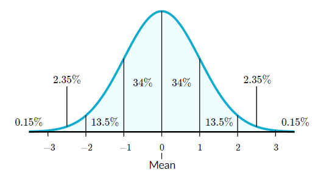

# Feature Engineering: Feature Scaling

Having features that are not scaled appropriately can cause Gradient Descent to take a longer time minimizing the cost function $J(\theta)$ as well as *noise* in a dataset. The ideal range for any feature is between -1 and 1 such that $-1\leq x \leq1 $. This is called a *normal* or *Gaussian* *distribution*. If we have a feature that is too large or too small we will need to scale them to optimize Gradient Descent.

Normal distributions have the following features:

- symmetric bell shape
- mean and median are equal; both located at the center of the distribution
- $\approx68\%$ of the data falls within 1 standard deviation of the mean
- $\approx95\%$ of the data falls within 2 standard deviations of the mean
- $\approx99.7\%$ of the data falls within 3 standard deviations of the mean

*Z-Scaling* is used to scale features up or down to a normal distribution range of $-1\leq x \leq1$ where we take the sum of the features ($x_i$), subtract the mean ($\mu_i$)  and then divide by the standard deviation ($\sigma_i$). A *Z-Scale* that has a range up to $-3\leq x \leq3$ could still considered to be within the normal range.

> $\hat{x} = \huge\frac{x_i-\mu_i}{\sigma_i}$