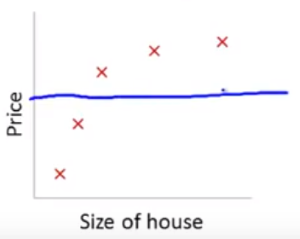

# Feature Engineering: Regularization

## Overfitting

*Overfitting* is when the machine learning model models the training set almost exactly. If there are too many features or the model maps too closely to the training set, the learned hypothesis may fit the training set very well (cost is at or near zero), but fail to generalize to new examples and therefore fail to make accurate predictions. *Generalization* refers to how accurate the model predictions are when given data outside of the training set.

*High bias* is a term that means the model makes a high preconception towards the data it's modeling and does not actually model the data as accurately as it should. If a model exhibits a high bias then more features can be added to get a bitter fit. However, as noted, too many features can lead to overfitting of the data.

Ways to address overfitting:

* Reduce the number of feature

  * Manually select which features to keep and those we may want to remove, or penalize.
  * Use a model selection algorithm.

* Regularization

  * Keep all the features, but reduce the magnitude (size of values) of parameters $\theta_j$.
  * Works well when we have a lot of features, each of which contributes to bit to predicting $y$.

## Types of Regularization

There are two main types of regularization that can be used with each having their own tradeoffs.

*L1 Regularization*, also called *Lasso Regression* (Least Absolute Shrinkage and Selection Operator) adds an *absolute value of magnitude* of coefficient as penalty term to the loss function. Lasso shrinks the less important feature’s coefficient to zero thereby removing some feature altogether. This works well for feature selection in case there is a huge number of features.

> $\lambda\sum\limits^{n}_{j=1}|\theta_j|$

*L2 Regularization*, also called *Ridge Regression* adds *squared magnitude* of coefficient as penalty term to the loss function. If lambda is zero then you get back OLS (Ordinary Least Square). However, if lambda is very large then it will add too much weight and it will lead to under-fitting. L2 works very well to avoid over-fitting issue as it scales values close to zero.

> $\lambda\sum\limits^{n}_{j=1}\theta^2_j$

## Cost Function Regularization

Regularization is the process of reducing the magnitude of our parameters $\theta_1$ to $\theta_n$. We don't want to reduce the magnitude of all theta values just those that are disproportionately higher. Also, we don't reduce the magnitude (penalize) $\theta_0$ since it is our intercept term.

Small parameter values $\theta_1,...,\theta_n$:

* Makes the hypothesis *simpler*. By *simple*, we mean a line that has less variance or complexity.
* Less prone to overfitting

This is achieved through a slight variation of the cost function by adding a *regularization* term which can be used for both linear and logistic cost functions. Below is an example using the linear cost function: 

> $J(\theta)=\frac{1}{2m}[\sum\limits^{m}_{i=1}(h_\theta(x)^{(i)}-y^{(1)})^2 +\lambda\sum\limits^{n}_{j=1}\theta_j^2]$

$\lambda$ is the *regularization parameter* that controls a tradeoff between two different goals. The first goal is fitting the training set well as represented by our regular cost function. The second goal is to keep our parameters small as represented by regularization term $\lambda\sum\limits^{n}_{j=1}\theta_j^2$.

In regularized linear regression we *choose* which parameters to minimize. If we minimized *all* of the parameter values, all of our parameters (aside of $\theta_0$) would be at or near zero. Thus, our hypothesis function would more closely resemble a horizontal straight line where $h_\theta(x)=\theta_0$. Just as choosing which parameters to minimize, we must carefully choose a good value for lambda.

## Gradient Descent Regularization

Below is the Gradient Descent algorithm where $m$ represents the number of examples and $i$ represents a specific example:

>*repeat until convergence {* 
>
>$\theta_0:=\theta_{0}-\alpha\frac{1}{m}\sum\limits ^{m}_{i=1}\left( h_{\theta }\left( x^{(i)}\right) -y^{( i)}\right)\cdot x_0^{(i)}$
>
>$\theta_j:=\theta_j-\alpha\frac{1}{m}\sum\limits ^{m}_{i=1}\left( h_{\theta }\left( x^{(i)}\right) -y^{( i)}\right)\cdot x_j^{(i)}$
>
>*}* 

For regularization, we want to make sure that the magnitude of our new theta values are lower. To do this, the Gradient Descent algorithm will change slightly by subtracting the regularization term $\frac{\lambda}{m}\theta_j$:

>$\theta_j:=\theta_j-\alpha\frac{1}{m}\sum\limits ^{m}_{i=1}\left( h_{\theta }\left( x^{(i)}\right) -y^{( i)}\right)\cdot x_j^{(i)}-\frac{\lambda}{m}\theta_j$

Factoring out the regularization term, this can be rewritten equivalently as follows:

> $\theta_j:=\theta_j(1-\alpha\frac{\lambda}{m})-\alpha\frac{1}{m}\sum\limits ^{m}_{i=1}\left( h_{\theta }\left( x^{(i)}\right) -y^{( i)}\right)\cdot x_j^{(i)}$

The regularization term $1-\alpha\frac{\lambda}{m}$ will yield a number that is less than $1$ and when multiplied by our theta value, will decrease it's magnitude.

## Normal Equation (NEEDS FURTHER RESEARCH)

The Normal Equation is shown below where $\beta$ is an $(n+1)$ x $(n+1)$ *identity matrix* where $n$ denotes the number features. Therefore, if the number of features is 2 then the matrix will be a $3$ x $3$ identity matrix.

> $\theta=(X^TX+\lambda\cdot\beta)^{-1}\cdot X^Ty$

### Non-Invertibility

If we can multiply a matrix by itself transposed, then it is said to be *invertible*. This can be the case if the number of rows and columns are the same. However, if the rows and columns are different then it is said to be *non-invertible*, *singular* or *degenerate*.  In the case of the normal equations this will happened if the number of features is greater than the number of examples making the matrix $X$ a rectangular matrix.

> If $m < n$, then the matrix is *non-invertible*
>
> If $m=n$, then the matrix is *invertible*