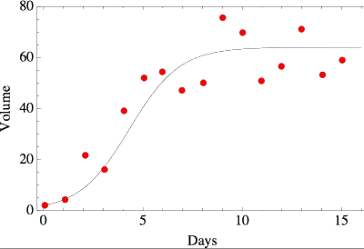

# Logistic Regression

Three types of *Logistic Regression* or *classification*:

- Binary (Pass/Fail)
- Multi (Cats, Dogs, Sheep)
- Ordinal (Low, Medium, High)

Even though Logistic Regression has the word "Regression" in the name, it is used to solve *classification* problems that are more complex and non-linear in nature. For example, the below data plot shows features that cannot be fit using a linear model.

## Activation Functions

In artificial neural networks, the *activation* function of a node defines the output of that node given an input or set of inputs. A standard computer chip circuit can be seen as a digital network of activation functions that can be "ON" or "OFF", depending on input. The *Sigmoid* function is one of several popular activation functions.

