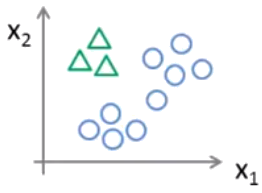
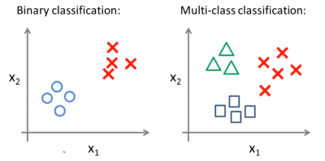

# Multiclass Classification

*Multiclass Classification* is *Logistic Regression* with more than two classes or outcomes. For example, classifying a type of car: van, truck, sports car, etc.  For example, possible $y$ values could be:

> $y=1$ for a van
>
> $y=2$ for a truck
>
> $y=3$ for a sports car

Multiclass Classification can be achieved using what is called *One-vs-All* (*One-vs-Rest*) where we basically make  each class a different *Binary Classification* problem. For example, in the illustration below we would produce three different *Binary Classification* problems to get three different predictions.

The below illustration depicts this concept. We pick one class and treat the other two classes as a single class and perform a single *Binary Classification* problem. This is what is meant by the term *One-vs-all*.

In the illustration above, the green triangles would be a value of $1$ and the blue circles would be a value of $0$. This is formally written as:

> $h^i_\theta(x) = y_1$ where the superscript, $i$ in this case, identifies the number of the class, 1, 2, or 3 for example.

We repeat this for the remainder of the classes producing three different predictions. This is expressed as, Given $i$ is $1$, $2$ or $3$ then what is the probability of $y=i$ given the values of $x$ and $\theta$:

> Given $i\in\{1,2,3\}$ then $h^i_\theta(x) = P(y=i|x;\theta) $

What we will end up with are different predictions for each classifier where we want select the prediction, $i$, that *maximizes* $h^i_\theta(x)$ (yields the highest probability).