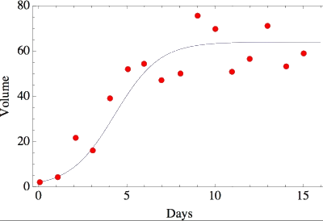
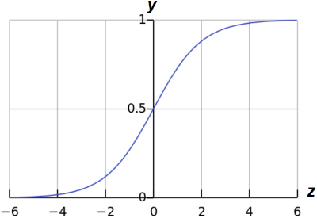

# Logistic Regression

Two types of *Logistic Regression* or *classification*: *Binary* and *Multi Class*. Even though Logic Regression has the word "Regression" in the name, it is used to solve classification problems that are more complex and non-linear in nature. For example, the below data plot shows features that cannot be fit using a linear model.

## Binary Classification

Solves classification problems (two classes). For example, trying to determine if email is spam or not spam. Below illustrates this more formally using the mathematic expression by saying $y$ is an *element* of ($\in$) $0$ or $1$:

> $y\in\{0,1\}$ 

Given them email example, $y=0$ would mean no spam where as $y=1$ would mean the email is spam. But how to determine if $y$ is $0$ or $1$? By using a *threshold* classifier such that our hypothesis function $h_\theta(x)$ predicts a value between $0$ and $1$. Such that:

> $0\le h_\theta(x)\le1$

For example:

> If $h_\theta(x)\ge  0.50$; Then predict $y=1$
>
> If $h_\theta(x)\lt  0.50$; Then predict $y=0$

To make predictions in this range we will need to use the *Sigmoid* function, also called the *Logistic* function.  Recall the hypothesis function for liner regression:

> $h_\theta(x)= \theta^Tx$

The *Sigmoid* Function ($g$) takes our hypothesis ($z$) as a parameter and returns a value between $0$ and $1$. For example:

> $z = h_\theta(x) \therefore g(z) = \frac{1}{1+e^-z}$

Below shows a plot of the *Sigmoid* function that shows the *threshold* at $0.5$.

In interpreting the value returned by the *Sigmoid* function, if it returns $y = .70$ when we say there is a $70\%$ chance that $y=1$ and therefore, by deduction, a $30\%$ chance that $y=0$. In a more concrete example, if malignant tumor features  lie in the range *above* $0.5$:

> $\vec x = \begin{bmatrix}{x_0\\x_1}\end{bmatrix}=\begin{bmatrix}{1\\tumorSize}\end{bmatrix}$

If $h_\theta(x) = 0.7$ then we say there is a $70\%$ chance the tumor might be malignant. Therefore, since  $.7 > .5$, we say that $y=1$. More formally, we write this in mathematical terms where we say, the *probability* that $y=1$, given feature $x$, parameterized by $\theta$:

> $h_\theta(x) = P(y=1|x;0)$

Therefore, the probability of $y=0$ plus the probability of $y=1$ will always be equal to $1$:

> $P(y=0|x;\theta) + P(y=1|x;\theta)=1$

Likewise, we can find the probability of $y$ being $0$ by subtracting the $y=1$ probability from $1$:

> $(y=0|x;\theta)=1-P(y=1|x;\theta)$

***TODO:*** *Learning algorithm for fitting the learning parameters theta* $\theta$.