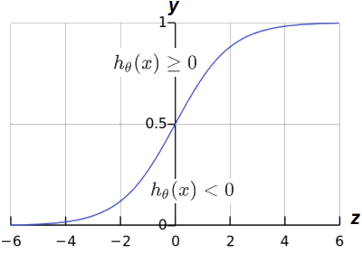
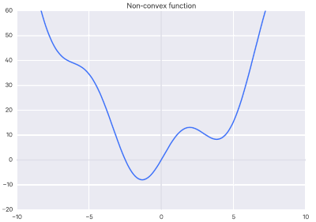
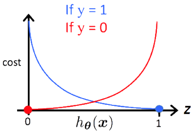
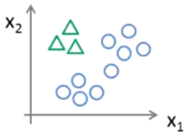

# Logistic Regression

Three types of *Logistic Regression* or *classification*:

- Binary (Pass/Fail)
- Multi (Cats, Dogs, Sheep)
- Ordinal (Low, Medium, High)

Even though Logistic Regression has the word "Regression" in the name, it is used to solve *classification* problems that are more complex and non-linear in nature. For example, the below data plot shows features that cannot be fit using a linear model.

## Binary Classification

*Binary Classification*, as it's name suggests, solves classification problems with only two classes. For example, trying to determine if email is spam or not spam. Below describes this more formally using a mathematic expression which says $y$ is an *element* of $0$ or $1$:

> $y\in\{0,1\}$ 

Given the email example, $y=0$ would mean no spam where as $y=1$ would mean the email is spam. But how to determine if $y$ is $0$ or $1$? By using a *threshold* classifier such that our hypothesis function $h_\theta(x)$ predicts a value between $0$ and $1$. Such that:

> $0\le h_\theta(x)\le1$

We predict a $y$ value of $0$ or $1$ by using the *threshold* of $0.50$ which is halfway between $0$ and $1$:

> If $h_\theta(x)\ge  0.50$; Then predict $y=1$
>
> If $h_\theta(x)\lt  0.50$; Then predict $y=0$

To get our hypothesis function to scale and make predictions in this range we will need to use the *Sigmoid* function, also called the *Logistic Function*.  Recall the hypothesis function for liner regression:

> $h_\theta(x)= \theta^Tx$

The *Sigmoid* Function, $g$, takes our hypothesis, $z$, as a parameter and returns a value between $0$ and $1$. For example:

> $z = h_\theta(x) \therefore g(z) = \frac{1}{1+e^-z}$

This will effectively scale our hypothesis prediction, $z$, to a value between $0$ and $1$. Our hypothesis prediction, $z$, controls the steepness of the Sigmoid curve. And the numerator, $1$ in this case, is the curves maximum value. The irrational number $e$ is also known as Euler’s number. It is approximately $2.718281$, and is the base of the natural logarithm.

Below shows a plot of the *Sigmoid* function that shows the *threshold* at $0.5$ which asymptotes (continually approaches but does not meet) at $1$ and $0$ with the $z$ axis on the horizontal:

It it worth noting that the prediction returned by the hypothesis function directly corresponds to the *Sigmoid* value, such that:

> $g(h_\theta(x)) \ge 0.5$ when $h_\theta(x) \ge 0$
>
> $g(h_\theta(x)) \lt 0.5$ when $h_\theta(x) < 0$

In interpreting the value returned by the *Sigmoid* function, if it returns $y = .70$ when we say there is a $70\%$ chance that $y=1$ and therefore, by deduction, a $30\%$ chance that $y=0$. In a more concrete example, if malignant tumor features  lie in the range *above* $0.5$:

> $\vec x = \begin{bmatrix}{x_0\\x_1}\end{bmatrix}=\begin{bmatrix}{1\\tumorSize}\end{bmatrix}$

If $g(h_\theta(x)) = 0.7$ then we say there is a $70\%$ chance the tumor might be malignant. Therefore, since  $.7 > .5$, we say that $y=1$. More formally, we write this in mathematical terms where we say, the *probability* that $y=1$, given feature $x$, parameterized by $\theta$:

> $g(h_\theta(x)) = P(y=1|x;\theta)$

Therefore, the probability of $y=0$ plus the probability of $y=1$ will always be equal to $1$:

> $P(y=0|x;\theta) + P(y=1|x;\theta)=1$

Likewise, we can find the probability of $y$ being $0$ by subtracting the $y=1$ probability from $1$:

> $(y=0|x;\theta)=1-P(y=1|x;\theta)$

### Decision Boundary

The *decision boundary* divides the plotted features from a data set. This boundary is used to determine regions that determine when $y=0$ or $y=1$. The decision boundary can be any equation, linear or non-linear, that best segments the data. Below will outline how to find this boundary using the *Sigmoid Function*.

For example, if we have the following hypothesis function:

> $h_\theta(x)=\theta_0+\theta_1x_1+\theta_2x_2$

And our parameters are:

> $\theta=\begin{bmatrix}-3\\1\\1\end{bmatrix}$

Then our *Sigmoid Function* is:

> $g(h_\theta(x))$ or $g(-3+1x_1+1x_2)$

Therefore, $y=1$ if $h_\theta(x)\ge3$ and $y=0$ if $h_\theta(x)\lt3$:

> $-3+x_1+x_2\ge0$

Or, rewritten as below where $3$, the y-intercept, denotes our *decision boundary*:

> $x_1 + x_2 \ge3$

Remember, that $\theta_0$ is our bias weight with a value of 1 since there are no features associated with it. So, we are basically saying that *our features lie beyond the boundary where $x_1$ or $x_2$ is 3*. Plotting the line $x_1 + x_2=3$ results in the decision boundary graphed below where both the $x_1$ axis and $x_2$ axis are intercepted at $3$. Therefore, any value on the right side of the decision boundary, where $x_1 + x_2 \ge3$, yields a $y$ value of $1$. Conversely, $x_1 + x_2 \lt3$ will result in a $y$ value of $0$.

It is important to note that the equation $x_1 + x_2=3$ corresponds to region where $g(h_\theta(x))=0.5$. Also, the decision boundary, is a property of the hypothesis and not the data set. In other words, removing all features from the graph does not impact the decision boundary or the hypothesis from determining the predicted value for $y$.

## Logistic Regression Cost Function

Below is the cost function from linear regression. Note the $\frac{1}{2}$ has been moved inside the summation to make things easier to understand for this topic.

> $J(\theta) = \frac{1}{m}\sum\limits^{m}_{i=1} \frac{1}{2}(h_\theta(x)^{(i)} - y^{(1)})^2$

Here, the *cost* is:

> $\frac{1}{2}(h_\theta(x)^{(1)} - y^{(i)})^2$

Therefore, for reasons described later, we can define our cost function as:

> $Cost(h_\theta(x), y)=\frac{1}{2}(h_\theta(x) - y)^2$

When this function is graphed it results in a *non-convex* graph with multiple local minimums: 

It is non-liner because of the *Sigmoid Function* $ \frac{1}{1+e^-z}$. When using *Gradient Decent* using this cost function you are not guaranteed to converge at the *global* minimum. What's needed is a convex cost function with a single global minimum. For this to happen, our cost function has to change:

> $Cost(h_\theta(x),y)=\left\{\begin{array}\mbox{-}log(g(h_\theta(x))&\mbox{if}&y=1\\\mbox{-}log(1-g(h_\theta(x))&\mbox{if}&y=0\end{array}\right\}$

When we plot this cost function we get a graph like below. The log functions where $y=0$ and $y=1$ actually continue on beyond the $z$ axis but we are only concerned with the range between 0 and 1.

Therefore, for the two *Cost* function parameters $h_\theta(x)$ and $y$:

> $\mbox{Cost}=0\mbox{ if  }y=1\mbox{ and }h_\theta(x)=1$

Likewise as $h_\theta(x)$ approaches 0, the cost will approach infinity since it asymptotes:

> $\mbox{as }h_\theta(x)\rightarrow0\mbox{ then }Cost\rightarrow\infin$

The graph above captures the intuition that if $h_\theta(x)=0$ (Predict $P(y=1|x;\theta)=0$), *but* we found out that $y=1$ in actuality, then we penalize the learning algorithm by a very large cost where $Cost\rightarrow\infin$

## Multiclass Classification

*Multiclass Classification* is *Logistic Regression* with more than two classes or outcomes. For example, classifying a type of car: van, truck, sports car, etc.  For example, possible $y$ values could be:

> $y=1$ for a van
>
> $y=2$ for a truck
>
> $y=3$ for a sports car

Multiclass Classification can be achieved using what is called *One-vs-All* (*One-vs-Rest*) where we basically make  each class a different *Binary Classification* problem. For example, in the illustration below we would produce three different *Binary Classification* problems to get three different predictions.

The below illustration depicts this concept. We pick one class and treat the other two classes as a single class and perform a single *Binary Classification* problem. This is what is meant by the term *One-vs-all*.

In the illustration above, the green triangles would be a value of $1$ and the blue circles would be a value of $0$. This is formally written as:

> $h^i_\theta(x) = y_1$ where the superscript, $i$ in this case, identifies the number of the class, 1, 2, or 3 for example.

We repeat this for the remainder of the classes producing three different predictions. This is expressed as, Given $i$ is $1$, $2$ or $3$ then what is the probability of $y=i$ given the values of $x$ and $\theta$:

> Given $i\in\{1,2,3\}$ then $h^i_\theta(x) = P(y=i|x;\theta) $

What we will end up with are different predictions for each classifier where we want select the prediction, $i$, that *maximizes* $h^i_\theta(x)$ (yields the highest probability).

## Activation Functions

In artificial neural networks, the *activation* function of a node defines the output of that node given an input or set of inputs. A standard computer chip circuit can be seen as a digital network of activation functions that can be "ON" or "OFF", depending on input. The *Sigmoid* function is one of several popular activation functions.

