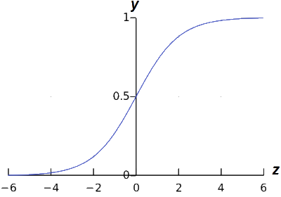

# Logistic Regression

Two types of *Logistic Regression* or *classification*: *Binary* and *Multi Class*. Even though Logic Regression has the word "Regression" in the name, it is used to solve classification problems that are more complex and non-linear in nature. For example, the below data plot shows features that cannot be fit using a linear model.

## Binary Classification

*Binary Classification*, as it's name suggests, solves classification problems with only two classes. For example, trying to determine if email is spam or not spam. Below describes this more formally using a mathematic expression which says $y$ is an *element* of $0$ or $1$:

> $y\in\{0,1\}$ 

Given the email example, $y=0$ would mean no spam where as $y=1$ would mean the email is spam. But how to determine if $y$ is $0$ or $1$? By using a *threshold* classifier such that our hypothesis function $h_\theta(x)$ predicts a value between $0$ and $1$. Such that:

> $0\le h_\theta(x)\le1$

For example:

> If $h_\theta(x)\ge  0.50$; Then predict $y=1$
>
> If $h_\theta(x)\lt  0.50$; Then predict $y=0$

To make predictions in this range we will need to use the *Sigmoid* function, also called the *Logistic* function.  Recall the hypothesis function for liner regression:

> $h_\theta(x)= \theta^Tx$

The *Sigmoid* Function, $g$, takes our hypothesis, $z$, as a parameter and returns a value between $0$ and $1$. For example:

> $z = h_\theta(x) \therefore g(z) = \frac{1}{1+e^-z}$

Our hypothesis prediction, $z$, controls the steepness of the Sigmoid curve. And the numerator, $1$ in this case, is the curves maximum value. The natural logarithm is denoted by $e$ which is a constant value of $2.718$.

Below shows a plot of the *Sigmoid* function that shows the *threshold* at $0.5$ which asymptotes at $1$ and $0$ with the $z$ axis on the horizontal:

It it worth noting that the prediction returned by the hypothesis function, denoted by $z$, directly corresponds to the *Sigmoid* value, such that:

> $h_\theta(x) \ge 0.5$ when $z \ge 0$
>
> $h_\theta(x) \lt 0.5$ when $z < 0$

In interpreting the value returned by the *Sigmoid* function, if it returns $y = .70$ when we say there is a $70\%$ chance that $y=1$ and therefore, by deduction, a $30\%$ chance that $y=0$. In a more concrete example, if malignant tumor features  lie in the range *above* $0.5$:

> $\vec x = \begin{bmatrix}{x_0\\x_1}\end{bmatrix}=\begin{bmatrix}{1\\tumorSize}\end{bmatrix}$

If $h_\theta(x) = 0.7$ then we say there is a $70\%$ chance the tumor might be malignant. Therefore, since  $.7 > .5$, we say that $y=1$. More formally, we write this in mathematical terms where we say, the *probability* that $y=1$, given feature $x$, parameterized by $\theta$:

> $h_\theta(x) = P(y=1|x;\theta)$

Therefore, the probability of $y=0$ plus the probability of $y=1$ will always be equal to $1$:

> $P(y=0|x;\theta) + P(y=1|x;\theta)=1$

Likewise, we can find the probability of $y$ being $0$ by subtracting the $y=1$ probability from $1$:

> $(y=0|x;\theta)=1-P(y=1|x;\theta)$

***TODO:*** *Learning algorithm for fitting the learning parameters theta* $\theta$.

### Decision Boundary

The *decision boundary* divides the plotted features from a data set. This boundary is used to determine regions that determine if $y=0$ or $y=1$. The decision boundary can be any equation, linear or non-linear, that best segments the data.

For example if we have the following hypothesis function:

> $h_\theta(x)=\theta_0+\theta_1x_1+\theta_2x_2$

And our parameters are:

> $\theta=\begin{bmatrix}-3\\1\\1\end{bmatrix}$

Then our *Sigmoid* function is:

> $g(h_\theta(x))$ or $g(\theta_0+\theta_1x_1+\theta_2x_2)$

And $y=1$ if $h_\theta(x)\ge0$:

> $-3+x_1+x_2\ge0$

Or, rewritten as:

> $x_1 + x_2 \ge3$

Plotting the line $x_1 + x_2=3$ results in the decision boundary graphed below where both the $x_1$ axis and $x_2$ axis are intercepted at $3$. Therefore, any value on the right side of the decision boundary, where $x_1 + x_2 \ge3$, yields a $y$ value of $1$. Conversely, $x_1 + x_2 \lt3$ will result in a $y$ value of $0$.

It is important to note that the equation $x_1 + x_2=3$ corresponds to region where $h_\theta(x)=0.5$. Also, the decision boundary, is a property of the hypothesis and not the data set. In other words, removing all features from the graph does not impact the decision boundary or the hypothesis from determining the predicted value for $y$.

## Activation Functions

In artificial neural networks, the *activation* function of a node defines the output of that node given an input or set of inputs. A standard computer chip circuit can be seen as a digital network of activation functions that can be "ON" or "OFF", depending on input. The *Sigmoid* function is one of several popular activation functions.

