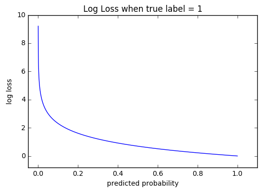

# Loss Functions

The purpose of the process of training a machine learning model is to minimize the [Kullback-Leibler divergence](https://en.wikipedia.org/wiki/Kullback–Leibler_divergence).

## Cross-Entropy

*Cross-Entropy*, also called *Log Loss*, *Bernoulli negative log-likelihood*, or *Binary Cross-Entropy* is a loss function that measures the performance of a classification model whose  output is a probability value between $0$ and $1$.

> **NOTE:** Cross-entropy and log loss are slightly different depending on context, but in machine learning when calculating error rates between 0 and 1 they resolve to the same thing.

As the probability diverges from the actual label (i.e. becomes closer to zero), the log loss increases. If the number of classes is more than $2$ (i.e. multiclass classification), we calculate a separate loss for each class label per observation and sum the result. Below is the equation where *log* is the *natural log*.

> $−(y\cdot log(p)) + ((1−y)\cdot log(1−p)))$

More formally:

> $J(\Theta)=-\frac{1}{m}[\sum\limits^{m}_{i=1}\sum\limits^{K}_{k=1}(-y^{(i)}_k\cdot log(h_\Theta(x^{(i)}))_k + (1-y^{(i)}_k)\cdot log(1-h_\Theta(x^{(i)}))_k)]$

## Hinge

## Huber

## Kullback-Leibler

## MAE (L1)

## MSE (L2)

###### Sources

##### https://ml-cheatsheet.readthedocs.io/en/latest/loss_functions.html#cost-function

##### https://www.quora.com/When-should-you-use-cross-entropy-loss-and-why

##### https://stats.stackexchange.com/questions/154879/a-list-of-cost-functions-used-in-neural-networks-alongside-applications