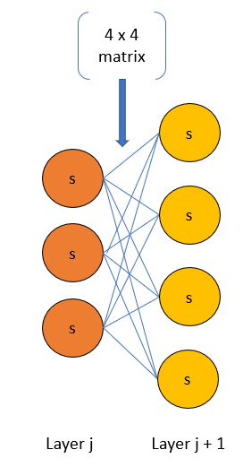

# Neural Networks

Below are the notations that are used going forward.

## Activation

> $a$ = activation function also called a unit or neuron.
>
> $a^{(j)}_i$ = activation function of the $i$th activation function (neuron) in the $j$th hidden layer.
>
> $a^{(2)}_1$ = activation function of the $1^{st}$ activation function (neuron) in the $2^{nd}$ hidden layer.

## Weights

> $\theta^{(j)}$ = matrix of weights controlling function mapping from layer $j$ to the next layer, $j+1$.
>
> $\theta^{(2)}$ = matrix of weights controlling function mapping from layer $2$ to layer $3$.

Input thetas to an activation function are superscripted with the index of the calling layer. For example:

> $\theta^{(2)}$ matrix would be input to $a^{(3)}_i$ and output a $\theta^{(3)}$ matrix.

## Matrix Dimensions

If a neural network has $s_j$ activation functions in layer $j$ and $s_{j+1}$ in layer $j+1$, then $\theta^{(j)}$ will be of dimension $s_{j+1}$ x $(j_j+1)$.

