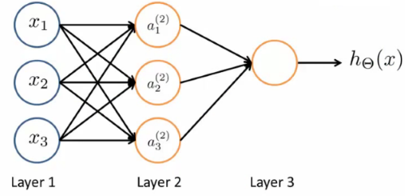
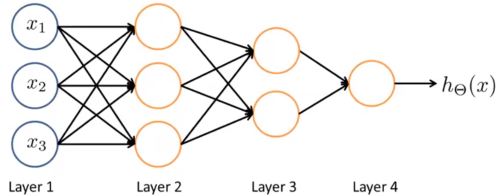

# Neural Networks

*Neural Networks* (NNs) or *Artificial Neural Networks* (ANNs) are much better for a complex non-linear hypothesis even when feature space is huge. They were originally motivated by looking at machines which replicate the brain's functionality. Neural networks were used a lot in the 80s and 90s with their popularity diminished in the late 90s. However, there has been a resurgence in neural networks because large scale NNs have became computationally feasible.

In neural networks, *layer 1* is the input layer followed by a number of *hidden layers* (layer 2 in the example below) and an *output layer* which produces the hypothesis result. Each layer is comprised of *activation functions* also called *neurons*. 

Neural networks can come in many different architectures such as below where there is an input layer, two hidden layers and an output layer:

## Notations

Below are common notations used with working with neural networks.

| Notation            | Description                                                  |
| ------------------- | ------------------------------------------------------------ |
| $W^i$ or $\Theta^i$ | Weights matrix for the $i^{th}$ layer                        |
| $b^i$               | Bias vector for the $i^{th}$ layer                           |
| $Z^{i}$             | Linear (affine) transformations of the given inputs for the $i^{th}$ layer |
| $g^i$               | Activation function applied to the $i^{th}$ layer            |
| $A^i$               | Post-activation output for the $i^{th}$ layer                |
| $dW^i$              | Derivative of the cost function with respect to $W^i(\frac{\partial J}{\partial W^i})$ |
| $db^i$              | Derivative of the cost function with respect to $b^i(\frac{\partial J}{\partial b^i})$ |
| $dZ^i$              | Derivative of the cost function with respect to $Z^i(\frac{\partial J}{\partial Z^i})$ |
| $dA^i$              | Derivative of the cost function with respect to $A^i(\frac{\partial J}{\partial A^i})$ |
| $n^i$               | Number of units (nodes) in the $i^{th}$ layer                |
| $m$                 | Number of examples                                           |
| $L$                 | Number of layers in the network (not including the input layer) |

