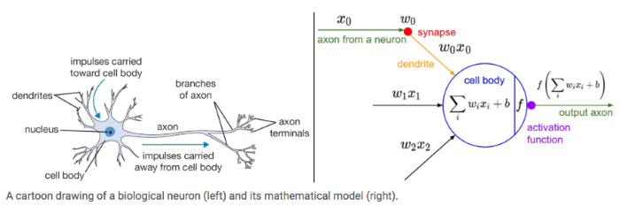

# Neural Networks and Deep Learning

*Neural Networks* (NNs) or *Artificial Neural Networks* (ANNs) are much better for a complex non-linear hypothesis even when feature space is huge. They were originally motivated by looking at machines which replicate the brain's functionality. Neural networks were used a lot in the 80s and 90s with their popularity diminished in the late 90s. However, there has been a resurgence in neural networks because large scale NNs have became computationally feasible. ANNs are modeled after how the human brain works as depicted below.

In neural networks, *layer 1* is the input layer followed by a number of *hidden layers* (layer 2 in the example below) and an *output layer* which produces the hypothesis result. Each layer is comprised of *activation functions* also called *neurons*. The graphic below depicts the most basic ANN with only a single hidden layer.

Neural networks can come in many different architectures such as below where there is an input layer, two hidden layers and an output layer.  Any ANN that has more than a single hidden layer is referred to as a *Deep Neural Network*. Having more than a single hidden layer allows an ANN to back propagate to prior layers and *self-learn*. This is in essence, *Deep Learning.*

# Classification

In *binary classification* of neural networks there is only one $K$ output unit where output $y\in\{0,1\}$. In *multi-class classification* there are two or more $K$ output units that are $K$ dimentional where $y\in\R^K$. For example if there are two classes $A$ and $B$ then the results of the output units would be:

> Two classes where $K=\begin{bmatrix}A\\B\end{bmatrix}$
>
> Is class $A$ where $K^1=\begin{bmatrix}1\\0\end{bmatrix}$
>
> Is class $B$ where $K^2=\begin{bmatrix}0\\1\end{bmatrix}$

Where there are three or more output units for classification then *one-vs-all* will be used.

# Notations

Below are common notations used with working with neural networks.

| Notation            | Description                                                  |
| ------------------- | ------------------------------------------------------------ |
| $W^l$ or $\Theta^l$ | Weights matrix for the $l^{th}$ layer                        |
| $b^l$               | Bias vector for the $l^{th}$ layer                           |
| $Z^l$               | Linear (affine) transformations of the given inputs for the $l^{th}$ layer |
| $g^l$               | Activation function applied to the $l^{th}$ layer            |
| $A^l$               | Post-activation output for the $l^{th}$ layer                |
| $dW^l$              | Derivative of the cost function with respect to $W^l(\frac{\partial J}{\partial W^l})$ |
| $db^l$              | Derivative of the cost function with respect to $b^l(\frac{\partial J}{\partial b^l})$ |
| $dZ^l$              | Derivative of the cost function with respect to $Z^l(\frac{\partial J}{\partial Z^l})$ |
| $dA^l$              | Derivative of the cost function with respect to $A^l(\frac{\partial J}{\partial A^l})$ |
| $n^l$ or $s^l$      | Number of units (nodes) in the $l^{th}$ layer not including the bias unit $bi$. |
| $m$                 | Number of examples                                           |
| $L$                 | Number of layers in the network (not including the input layer) |
| $K^l$               | The classifier of the $l^{th}$ node in the output layer      |

