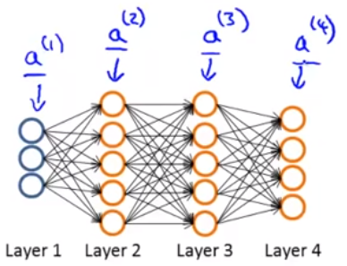

# Forward Propagation

## Matrix Dimensions

The values passed between layers in a neural network a represented as a matrix of values (or weights) as denoted by $\Theta$ or $W$ where:

> $\Theta^{(j)}_{mn}$ is a matrix of values controlling function mapping from layer $j$ to the next layer, $j+1$ and $m$ and $n$ are the row and column of the matrix value.
>
> $\Theta^{(2)}_{12}$ is a matrix of values controlling function mapping from layer $2$ to layer $3$ and the value at $1,2$.

Input thetas to an activation function are superscripted with the index of the calling layer where:

> $\Theta^{(2)}$ matrix would be input to activation function $a^{(3)}_i$ which would output a $\theta^{(3)}$ matrix.

In neural networks, one of the major challenges is getting matrix dimensions right. If a neural network has $s_j$ activation functions in layer $j$ and $s_{j+1}$ in layer $j+1$, then $\theta^{(j)}$ will be of dimension $s_{j+1}$ x $(s_j+1)$.  We say $+1$ because we are adding a bias unit of $1$ in the same way that's done for linear and logistic regression. In other words, the number of rows ($m$) is the number of activation functions in the next layer and the number of columns ($n$) is the number of activation functions plus 1 from the current layer. For example:

> If layer $2$ contains $20$ activation functions and layer $3$ contains $30$ activation functions
>
> then, the dimensions of the $\Theta$ matrix would be $30$ x $21$.

## Activation Function Calculations

For layer $1$, which are our $x$ values, we can reference as $a^{(1)}j$ just as if it were the results from any other activation function:

> **Layer 1 (Input Layer)**
>
> $a^{(1)}_j=x_j$

In referencing the diagram above, below is an example with the three activation functions in layer $2$ each using a *Sigmoid* activation function $g$:

> **Layer 2**
>
> $a^{(2)}_1=g(\Theta^{(1)}_{10}x_0+\Theta^{(1)}_{11}x_1+\Theta^{(1)}_{12}x_2+\Theta^{(1)}_{13}x_3)=g(z^{(2)}_1)$
>
> $a^{(2)}_2=g(\Theta^{(1)}_{20}x_0+\Theta^{(1)}_{21}x_1+\Theta^{(1)}_{22}x_2+\Theta^{(1)}_{23}x_3)=g(z^{(2)}_2)$
>
> $a^{(2)}_3=g(\Theta^{(1)}_{30}x_0+\Theta^{(1)}_{31}x_1+\Theta^{(1)}_{32}x_2+\Theta^{(1)}_{33}x_3)=g(z^{(2)}_3)$

The hypothesis function in layer $3$ would be:

> **Layer 3 (Output Layer)**
>
> $h_\Theta(x)=a^{(3)}_1=g(\Theta^{(2)}_{10}a^{(2)}_0+\Theta^{(2)}_{11}a^{(2)}_1+\Theta^{(2)}_{12}a^{(2)}_2+\Theta^{(2)}_{13}a^{(2)}_3)=g(z^{(3)})$

### 4 Layer Example

In summary, for a 4 layer neural network with a single $x$ value it would be:

> $a^{(1)}=x$
>
> $z^{(2)}=\Theta^{(1)}a^{(1)}$
>
> $a^{(2)}=g(z^{(2)})$ plus $a_0^{(2)}$
>
> $z^{(3)}=\Theta^{(2)}a^{(2)}$
>
> $a^{(3)}=g(z^{(3)})$ plus $a_0^{(3)}$
>
> $z^{(4)}=\Theta^{(3)}a^{(3)}$
>
> $a^{(4)}=h_\Theta(x)=g(z^{(4)})$

## Vectorized Calculations

The following illustrates the input, vectorized computation for layer 2 and output in layer 3. This process is also called *forward propagation*.

Layer 1 (input) is expressed as a 4 dimensional vector (matrix) in this case which includes a bias column (matrix values are arbitrary). Note that layer 1 can also be reference as $a^{(1)}$:

> $a^{(1)}=x=\begin{bmatrix}1&1&2&3\\1&4&5&6\\1&7&8&9\end{bmatrix}$

Our theta values, used was weights for layer 2, would be expressed as a 4 dimensional vector which serves as the *mapping* between layer 1 and layer 2. The *mapping* happens in the black lines in the illustration above.

> $\Theta^{(1)}=\begin{bmatrix}\Theta^{(1)}_{10}&\Theta^{(1)}_{11}&\Theta^{(1)}_{12}&\Theta^{(1)}_{13}\\\Theta^{(1)}_{20}&\Theta^{(1)}_{21}&\Theta^{(1)}_{22}&\Theta^{(1)}_{23}\\\Theta^{(1)}_{30}&\Theta^{(1)}_{31}&\Theta^{(1)}_{32}&\Theta^{(1)}_{33}\end{bmatrix}$

In layer 2, we want to call our Sigmoid function with the input passed in to layer 1 where:

> $z^{(2)}=\Theta^{(1)}x=\Theta^{(1)}a^{(1)}$

Therefore our "new x values" used as input to layer 3 would be:

> $a^{(2)}=g(z^{(2)})=g(\Theta^{(1)}x)=g(\Theta^{(1)}a^{(1)})$

In layer 3, we would have a different set of weights and to compute our hypothesis, which service as the *mapping* between layer 2 and layer 3. We would our output for layer 2 as follows where $a^{(2)}_0$ is the bias unit of $1$ where:

> $z^{(3)}=\Theta^{(2)}a^{(2)}$

Expanded, would be:

> $h_\Theta(x)=g(z^{(3)})=g(\Theta^{(2)}_{10}a^{(2)}_0+\Theta^{(2)}_{11}a^{(2)}_1+\Theta^{(2)}_{12}a^{(2)}_2+\Theta^{(2)}_{13}a^{(2)}_3)$