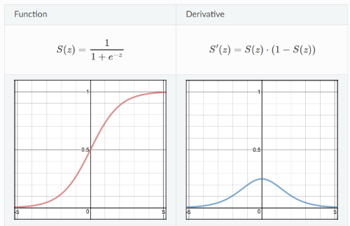
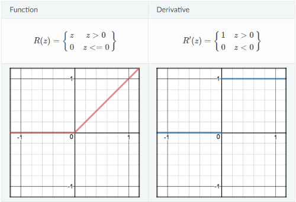

# Activation Functions

In artificial neural networks, the *activation* function (also referred to as a unit or neuron) defines the output of that node given an input or set of inputs. Every output from an activation function is the input to every activation function in the following layer. A standard computer chip circuit can be seen as a digital network of activation functions that can be "ON" or "OFF", depending on input. 

Activation functions serve as *threshold*, *classification*, or sometime even called a *partition*. Bengio et al. refers to this as [*Space Folding*](https://arxiv.org/pdf/1402.1869.pdf). What activation functions do is bascially create a partition thereby dividing the original space into two partitions (typically).


There have been over $640$ different variations of activation function proposals and there is no definitive guide for which activation function works best on specific problems. However, there are only a handfull of activation functions that ar recommended for use and of those, the most popular are described below. It’s a trial and error process where one should try different set of functions and see which one works best on the problem at hand.

Activation functions are typically denoted by $a$ where:

> $a^{(j)}_i$ is an activation function of the $i$th activation function (neuron) in the $j$th hidden layer.
>
> $a^{(2)}_1$ is an activation function of the $1^{st}$ activation function (neuron) in the $2^{nd}$ hidden layer.

## Sigmoid ($\large\sigma$)

$g(z)=\large\frac{1}{1+e^{-z}}$

The Sigmoid function returns a value that is between $0$ and $1$ and is a good candidate for classifiation problems. Therefore, it works nicely as an output function since it can return a probability as the output where a high positive probability would be closer to $1$. The Sigmoid function, as shown below, only has a $y$ value range between $0$ and $1$. This means for every input $z$, no matter how large, will always result in a small change in $y$ value. As a result, when plotting the loss for Sigmoid, it's gradient (derivative) is very close to zero which gives rise to the problem of *vanishing gradients*. Because of this small gradient, using it for an activation function makes learning slow and more difficult. The network will stop learning or learning is drastically slow depending on use case and until gradient / computation gets hit by floating point value limits.



```python
import numpy as np

def sigmoid(z):
    a = 1 / (1 + np.exp(-z))
    return a
```

## Hyperbolic Tangent (Tanh)

$g(z)=\large\frac{e^z-e^{-z}}{e^z+e^{-z}}$

Hyperbolic Tagent is better than sigmoid in that the range of values don't center around $0.5$ but $0$ so it is generally perferred over Sigmoid for learning. The gradient it more prominent that Sigmoid but, like the Sigmoid, the gradient is still small making learning slow.


```python
import numpy as np

def tanh(z):
    a = np.tanh(z)
    return a
```

## Rectified Linear Unit (ReLU)

$g(z)=max\{0,z\}$

ReLU range is $0$ to $inf$, avoids the vanishing gradient problem and is less intensive computationally since the math is simpler. It's still non-linear in nature and is recommended to only be used in neural network hidden layers. If used in deep networks, the proabability of resulting in dead neurons increases because some gradients can become fragile during training and cause a weight update that cause the actiation unit to never activate. More specifically, when training during back propogation if an $x$ value is less than $0$, the resulting gradient is $0$ and will stop responding to input variations (e.g. always outputing $0$). This scenario is often times called the *dying ReLU problem*. In an effort to overcome the dying ReLU problem, changing the way parameters are initialized using random asymetry can help (See also: [Dying ReLU and Initialization: Theory and Numerical
Examples white paper](https://arxiv.org/pdf/1903.06733.pdf) by Lu Lu and Yeonjong Shin, et. al.)



```python
import numpy as np

def relu(a):
    a = np.maximum(0, z)
    return a
```


## Leaky Rectified Linear Unit  (Leaky ReLU)

$g(z)=max\{\alpha\cdot z,z\}$

Leaky ReLU attempts to overcome the zero gradient issue of ReLU. It overcomes this by supplying a small, non-zero gradient, $\alpha$ value (usually 0.01) for $z$ values $\le0$. However, since it possesses liniarity using a constant gradient for values $\le0$ it really can't be used for complex classification problems like Sigmoid or Tanh.


```python
import numpy as np

def leaky_relu(z):
    a = np.maximum(0.1 * z, z)
    return a
```

## Randomized ReLU

https://isaacchanghau.github.io/post/activation_functions/

## Maxout

## Softmax

## ELU


## Matrix Dimensions

The values passed between layers in a neural network a represented as a matrix of values (or weights) as denoted by $\Theta$ or $W$ where:

> $\Theta^{(j)}_{mn}$ is a matrix of values controlling function mapping from layer $j$ to the next layer, $j+1$ and $m$ and $n$ are the row and column of the matrix value.
>
> $\Theta^{(2)}_{12}$ is a matrix of values controlling function mapping from layer $2$ to layer $3$ and the value at $1,2$.

Input thetas to an activation function are superscripted with the index of the calling layer where:

> $\Theta^{(2)}$ matrix would be input to activation function $a^{(3)}_i$ which would output a $\theta^{(3)}$ matrix.

### Matrix Dimensions

In neural networks, one of the major challenges is getting matrix dimensions right. If a neural network has $s_j$ activation functions in layer $j$ and $s_{j+1}$ in layer $j+1$, then $\theta^{(j)}$ will be of dimension $s_{j+1}$ x $(s_j+1)$.  We say $+1$ because we are adding a bias unit of $1$ in the same way that's done for linear and logistic regression. In other words, the number of rows ($m$) is the number of activation functions in the next layer and the number of columns ($n$) is the number of activation functions plus 1 from the current layer. For example:

> If layer $2$ contains $20$ activation functions and layer $3$ contains $30$ activation functions
>
> then, the dimensions of the $\Theta$ matrix would be $30$ x $21$.

## Activation Function Calculations


In referencing the diagram above, below is an example with the three activation functions in layer $2$ each using a *Sigmoid* activation function $g$:

> $a^{(2)}_1=g(\Theta^{(1)}_{10}x_0+\Theta^{(1)}_{11}x_1+\Theta^{(1)}_{12}x_2+\Theta^{(1)}_{13}x_3)=g(z^{(2)}_1)$
>
> $a^{(2)}_2=g(\Theta^{(1)}_{20}x_0+\Theta^{(1)}_{21}x_1+\Theta^{(1)}_{22}x_2+\Theta^{(1)}_{23}x_3)=g(z^{(2)}_2)$
>
> $a^{(2)}_3=g(\Theta^{(1)}_{30}x_0+\Theta^{(1)}_{31}x_1+\Theta^{(1)}_{32}x_2+\Theta^{(1)}_{33}x_3)=g(z^{(2)}_3)$

The hypothesis function in layer $3$ would be:

> $h_\Theta(x)=a^{(3)}_1=g(\Theta^{(2)}_{10}a^{(2)}_0+\Theta^{(2)}_{11}a^{(2)}_1+\Theta^{(2)}_{12}a^{(2)}_2+\Theta^{(2)}_{13}a^{(2)}_3)$

### Vectorized Calculations

The following illustrates the input, vectorized computation for layer 2 and output in layer 3. This process is also called *forward propagation*.

Layer 1 (input) is expressed as a 4 dimensional vector (matrix) in this case which includes a bias column (matrix values are arbitrary). Note that layer 1 can also be reference as $a^{(1)}$:

> $a^{(1)}=x=\begin{bmatrix}1&1&2&3\\1&4&5&6\\1&7&8&9\end{bmatrix}$

Our theta values, used was weights for layer 2, would be expressed as a 4 dimensional vector which serves as the *mapping* between layer 1 and layer 2. The *mapping* happens in the black lines in the illusration above.

> $\Theta^{(1)}=\begin{bmatrix}\Theta^{(1)}_{10}&\Theta^{(1)}_{11}&\Theta^{(1)}_{12}&\Theta^{(1)}_{13}\\\Theta^{(1)}_{20}&\Theta^{(1)}_{21}&\Theta^{(1)}_{22}&\Theta^{(1)}_{23}\\\Theta^{(1)}_{30}&\Theta^{(1)}_{31}&\Theta^{(1)}_{32}&\Theta^{(1)}_{33}\end{bmatrix}$

In layer 2, we want to call our Sigmoid function with the input passed in to layer 1 where:

> $z^{(2)}=\Theta^{(1)}x=\Theta^{(1)}a^{(1)}$

Therefore our "new x values" used as input to layer 3 would be:

> $a^{(2)}=g(z^{(2)})=g(\Theta^{(1)}x)=g(\Theta^{(1)}a^{(1)})$

In layer 3, we would have a different set of weights and to compute our hypothesis, which service as the *mapping* between layer 2 and layer 3. We would our output for layer 2 as follows where $a^{(2)}_0$ is the bias unit of $1$ where:

> $z^{(3)}=\Theta^{(2)}a^{(2)}$

Expanded, would be:

> $h_\Theta(x)=g(z^{(3)})=g(\Theta^{(2)}_{10}a^{(2)}_0+\Theta^{(2)}_{11}a^{(2)}_1+\Theta^{(2)}_{12}a^{(2)}_2+\Theta^{(2)}_{13}a^{(2)}_3)$