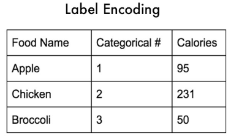

# Encoding

*Encoding* is part of pre-preprocessing when it comes to AI. Encoding is a way to change data to a format that makes it easier to process. There are different ways of encoding data with more formal methods like *Label Encoding* and *One Hot Encoding*. 

## Label Encoding

*Label Encoding* is basically just changing a text field to numeric. For example, different categories such as type of car or breed of animal where each distinct category is given a numeric value.

The problem with Label Encoding is that the numerical categories that are assigned to each class are ordered. Computers naturally treat higher order numbers as higher numbers. That is to say, it will give higher numbers more weight.



*Imagine if you had 3 categories of foods: apples, chicken, and broccoli. Using label encoding, you would assign each of these a number to categorize them: apples = 1, chicken = 2, and broccoli = 3. But now, if your model internally needs to calculate the average across categories, it might do 1+3 = 4/2 = 2. This means that according to your model, the average of apples and chicken together is broccoli.* 

## One Hot Encoding

*One Hot Encoding* Uses a binary style of categorization.  This basic principal is that the categories are now columns instead of rows. One Hot Encoding is not necessarily *better* than Label Encoding it's just a different tool for a different job and addresses the label encoding issue outlined above.


### Example Using sklearn

sklearn's *fit_transform* first *fits* the data by converting the category names to numerical equivalents. *Transform* then converts the numeric values into the columnar/binary equivalent.

```python
from sklearn.preprocessing import LabelEncoder, OneHotEncoder
import numpy as np
import pandas as pd

dataset = pd.read_csv('made_up_thing.csv')
X = dataset.iloc[:, :-1].values
le = LabelEncoder()
X[:, 0] = le.fit_transform(X[:, 0])
ohe = OneHotEncoder(categorical_features = [0])
X = ohe.fit_transform(X).toarray()
```


### Sources

 https://medium.com/@michaeldelsole/what-is-one-hot-encoding-and-how-to-do-it-f0ae272f1179 