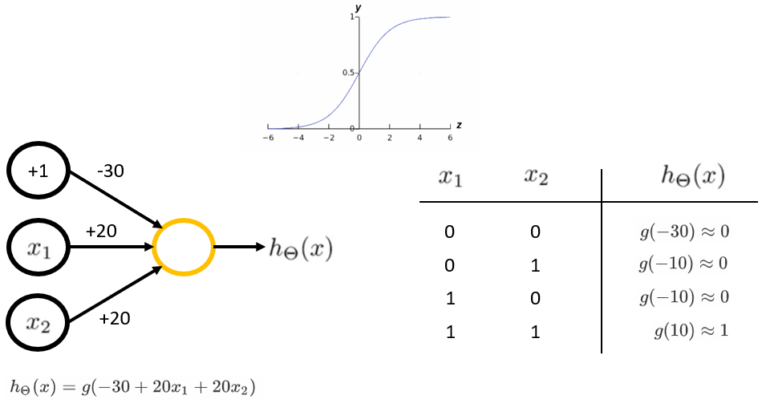

# Neural Network Logic Gates

Different networks and activation functions can be combined to create even more complex networks creating a series of logic such as AND, NOT, OR, XNOR, etc.

## AND

The AND gate is 1 only if all inputs, $x$ values, are 1 else 0. Using the Sigmoid function as used in Logistic Regression where a value $\geq0.5$ is $1$ else $0$.

This can be broken down as follows:

> $z^{(2)}_1=-30+(20\cdot0)+(20\cdot0)=-30\therefore g(z^{(2)}_1)\approx0$
>
> $z^{(2)}_2=-30+(20\cdot0)+(20\cdot1)=-10\therefore g(z^{(2)}_2)\approx0$
>
> $z^{(2)}_3=-30+(20\cdot1)+(20\cdot0)=-10\therefore g(z^{(2)}_3)\approx0$
>
> $z^{(2)}_4=-30+(20\cdot1)+(20\cdot1)=10\therefore g(z^{(2)}_4)\approx1$

Therefore, given the above example, the classification is positive ($1$) if and only if $x^1$ and $x^2$  equals $1$.

## OR

The OR gate is 1 if any of the inputs, $x$ values, are 1 else 0. Using the Sigmoid function as used in Logistic Regression where a value $\geq0.5$ is $1$ else $0$.

## XNOR

XNOR is a simpler way of saying NOT ( $x_1$ XOR $x_2$ )

