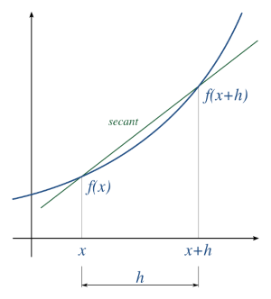
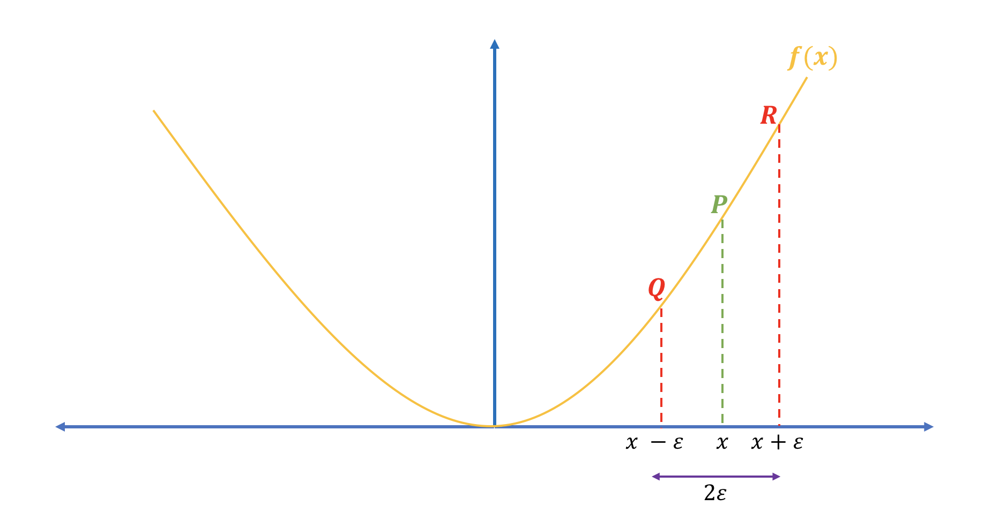
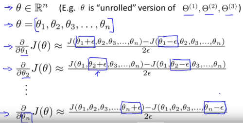

# Gradient Checking

When writing code to perform back propagation you could have a subtle bug that may give the appearance that $J(\Theta)$ is decreasing when in fact it is not or not as much as it should be. This is where *gradient checking* comes into play.

## Numerical Estimation of Gradients

To determine if our back propagation code is working as expected, we can check it with estimating what the actual gradient should be. This is also called *numerical differentiation*. What we do is, for each $x$ value, calculate the estimated gradient at that point and then compare it to the gradient computed by our back propagation algorithm during back propagation.

There are two ways to get the estimated gradient at a particular point on a graph. The first is *one-sided difference* or *right-hand form*. For one-sided we take our current $x$ value and increase it by an arbitrary amount $h$. This can be visualized by the secant line below. Next, we simply compute the gradient with respect to $x$ of our cost function for neural  networks $J(x)$.

Relative to our cost function $J(\Theta)$ and $\Theta$ just being a single real number, the right-hand form would look like the below:

> $\large\frac{J(\Theta + h) - J(\Theta)}{h}$

The other way to get the estimated gradient is to use the *two-sided difference* or t*wo-sided form*. This methods is preferred and more accurate than right-handed form. It's the same as one-sided except instead of adding $h$ ($\large\epsilon$ in the graph below) we also subtract $h$ giving us a little larger range. Then divide that by $2h$ instead of just $h$.

Relative to our cost function $J(\Theta)$ and $\Theta$ just being a single real number, the two-sided form would look like the below:

> $\large\frac{J(\Theta + h) - J(\Theta - h)}{2h}$

For $h$ you need to choose a small value like $10^{-4}$ but not too small since you could run into numerical problems such as divide by zero.

We will then check it to make sure it is close to the back propagation computed derivative with respect to $\Theta$ for our cost function $J$, say a difference of no more than $10^{-7}$:

> $\large\frac{\partial}{\partial \Theta}J(\Theta)\approx\large\frac{J(\Theta + h) - J(\Theta - h)}{2h}$

## Numerical Estimation of Gradients and Vectors

When computing the estimated gradient of a vector or matrix its the same process as above just with respect to each prameter $\Theta$ value. Below is an illustration where we add and subract each parameter $\Theta$ and compute the partial derivative with respect to each $\Theta$ value:

