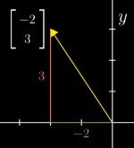
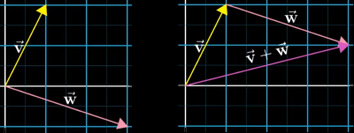
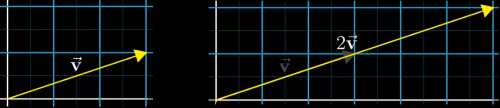
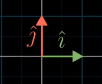
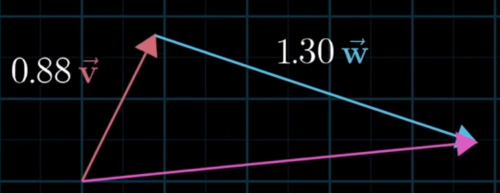
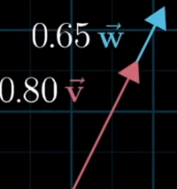
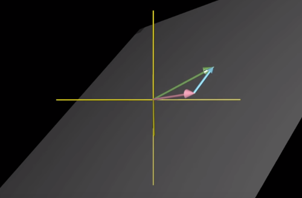
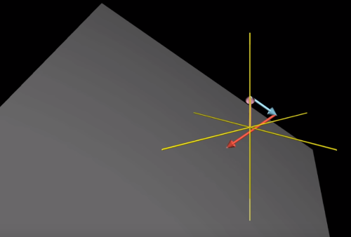

# Linear Algebra for Machine Learning

## Vectors

A *vector* is defended as a line (or arrow) on the $xy$ coordinate plain that has both direction and length. For the most part vectors, in mathematics, will almost always be rooted at the origin $(0,0)$. Vectors are written simply a matrix with a single column (an $n$ x $1$ matrix). We would express the dimensionality of the below as simply a three dimensional vector, or $\R^3$ where $y_2 = 21$.

> $\vec y =\begin{bmatrix}18\\21\\33\end{bmatrix}$

Below is a visual representation of a vector:

Most linear algebra topics tend to revolve around *adding* vectors and *scaling* vectors.

## Adding Vectors

When adding vectors you take the second vector and move the tail to the head of first vector. The distance between the origin and the head of the second vector is the sum. The illustration below shows visually how adding vectors works.  The distance of $\vec V$ and $\vec W$ is the same total distance as $\vec V + \vec W$.

## Scaling Vectors

*Scaling* a vector means changing it's size by multiplying by a *scalar*. For example take a vector and multiply it by a *scalar* of $2$ as shown below.

> $\vec v=\begin{bmatrix}3\\1\end{bmatrix}$
>
> $2\vec v=2\cdot\begin{bmatrix}3\\1\end{bmatrix}=\begin{bmatrix}6\\2\end{bmatrix}$

## Basis Vectors

The *basis* of a vector space is a set of *linearly independent* vectors that *span* the full space. The following sections outline this concept in more detail.

There are different types of basis vectors. Basis vectors (unit vectors) can have a length of $1$ in a normed vector space as shown below. In this case, these two important vectors are $\hat{i}$ and $\hat{j}$, each with a length of $1$ (In a 3D space we would also use $\hat{z}$). These are call *basis vectors* because they are the *basis of a coordinate system*. By *basis* we mean, when describing vectors numerically, it directly depends on which type of basis vectors you are using. In this case, $\hat{i}$ and $\hat{j}$  which each have a length of $1$. From these basis vectors we can add and scale them.

> **NOTE:** The hat symbol $\hat{}$ is called a *circumflex* but pronounced "hat"
>
> **NOTE:**  It is also worth noting that $\hat{i}$, $\hat{j}$ and $\hat{z}$ represent vectors where $x$, $y$ and $z$ represents *points* and *axes*.

When we think of a vector like the below:

> $\vec v=\begin{bmatrix}3\\1\end{bmatrix}$

With basis vectors, we think of it as *scaling*  $\hat{i}$ and $\hat{j}$ by $3$ and $1$ respectively:

> $\vec v=\begin{bmatrix}3\hat{i}\\1\hat{j}\end{bmatrix}$

### Linear Combinations

Any time you add *and* scale two vectors, it is called a *linear combination*. The below shows a linear combination where $a$ and $b$ are <u>scalars</u> that scale the two vectors $\vec v$ and $\vec w$.

> $a\vec v + b\vec w$

For example:

> $0.88\vec v + 1.30\vec w$

For a linear combination with three vectors we simply add the third vectors and scalar:

>$a\vec v + b\vec w + c\vec u$

### Span

The *span* of any two vectors is the set of all of their linear combinations where scalars $a$ and $b$ can vary. If we were to stretch and pull the resulting vector (magenta in this case) to exactly every point possible for their linear combination in 2 dimensions the *span* would be every possible point on the 2D plane.

However, if the vectors are inline as below, their *span* would just be a straight line. In this case, we would say the two vectors are *linearly dependent* since second vector does not really change the span of the linear combination.

Therefore, we could say that one of the vectors can be expressed as a linear combination of the other two vectors since it lies in the same span as the other two vectors:

> $\vec u=a\vec v + b\vec w$

If the second vector does add another dimension to the span they are said to be *linearly independent*:

> $\vec u\neq a\vec v + b\vec w$

In 3D space, if we were to stretch and pull the resulting vector to exactly every point possible for their linear combination the *span* would resemble a flat sheet.

For a linear combination with three vectors, we would have access to every 3 dimensional point just as with a linear combat ion of 2 vectors gives us access to every point on the 2D plane. Here, the tip of the third vector "moves the sheet" in 3 dimensions giving access to all possible points in the 3D space.

## Matrices

A matrix is simply a rectangular array of numbers and the *dimension* of a matrix is written as *rows x columns*. For the example below, the dimension of the matrix would be *2x3*. Often times you will see the matrix dimensionality depicted as $\R^{2x3}$ where $\R$ simply denotes a *real number*.

> $\begin{bmatrix}1&2&3\\4&5&6 \end{bmatrix}$

To reference a specific element in a matrix we would specify the row and column. For the example below, matrix $A$, $A_{12}$ would give us the number in the $1^{st}$ row and $2^{nd}$ column which would be the number $2$. The indexes of matrices can be *1-indexed* or *0-indexed*, meaning, the first element (row or column) starts at either *1* or *0*. Matrices are also, by convention, referenced with *uppercase* letters and numbers and vectors with *lowercase* letters.

> $A = \begin{bmatrix}10&24&35\\34&15&76 \end{bmatrix}\therefore A_{12} = 24$

## Matrix Addition & Subtraction

When adding or subtracting one matrix from another we simply add or substract each number in each column with it's corresponding number in the other matrix. Also, both matrices must be of the same dimension. For example:

> $\begin{bmatrix}1&3&5\\7&9&2\\3&4&1\end{bmatrix} + \begin{bmatrix}3&2&0\\3&1&4\\6&9&8\end{bmatrix} = \begin{bmatrix}4&5&5\\10&10&6\\9&13&9\end{bmatrix}$

## Matrix Multiplication and Division

To multiply or divide two matrices the number of columns in one matrix must be equal to the number of rows in the other matrix.

To multiply matrices you will need to multiply the first number of the *multiplier* vector by the first number of in the first column of the *multiplicand* vector. Then, multiply the second number in the multiplier vector by the second number in the multiplicand vector and add the the products which becomes the first value in the product vector. Do this for each number in the multiplicand vector. For example:

> $\begin{bmatrix}1&3\\4&0\\2&1\end{bmatrix}\cdot\begin{bmatrix}1\\5\end{bmatrix}=\begin{bmatrix}(1\cdot1)+(3\cdot5)\\(4\cdot1)+(0\cdot5)\\(2\cdot1)+(1\cdot5)\end{bmatrix}=\begin{bmatrix}16\\4\\7\end{bmatrix}$

Here is an example with a larger multiplier matrix:

> $\begin{bmatrix}2&3\\7&9\\3&4\end{bmatrix}\cdot\begin{bmatrix}2&5&1\\3&6&2\\\end{bmatrix}=\begin{bmatrix}(2\cdot2) +(3\cdot3)\\(5\cdot7)+(6\cdot9)\\(1\cdot3)+(2\cdot4)\end{bmatrix}=\begin{bmatrix}13\\89\\11\end{bmatrix}$

### Example With Hypothesis Function

Below is an example of using matrices to compute predictions for a hypothesis function. This is the preferred way to solve using code (such as Python) as it is more computationally efficient.

Given a set of features: 

> $2014, 1416, 1534, 852$

And a hypothesis:

> $h_\theta(x)=-40+0.25x$

Then, using matrices:

> $\begin{bmatrix}1&2014\\1&1416\\1&1534\\1&852\end{bmatrix}\cdot\begin{bmatrix}-40\\0.25\end{bmatrix}=\begin{bmatrix}463.50\\314.00\\343.50\\173.00\end{bmatrix}$

## Scalar Multiplication and Division

Scalar multiplication and division are performed the same way. Below is an example of multiplying a matrix by a scalar, in this case, the number 2:

> $2\cdot\begin{bmatrix}2&3&5\\7&9&2\\3&4&1\end{bmatrix}=\begin{bmatrix}4&6&10\\14&18&4\\6&4&2\end{bmatrix}$

## Combination of Operands

Just as with any mathematical equation you must follow the order of operations. For example, with the below:

> $3\cdot\begin{bmatrix}1\\4\\2\end{bmatrix}+\begin{bmatrix}0\\0\\5\end{bmatrix}-\begin{bmatrix}3\\0\\2\end{bmatrix}\div3$
>
> $=\begin{bmatrix}3\\12\\6\end{bmatrix}+\begin{bmatrix}0\\0\\5\end{bmatrix}-\begin{bmatrix}0\\1\\\frac{2}{3}\end{bmatrix}$
>
> $=\begin{bmatrix}2\\12\\10\frac{1}{3}\end{bmatrix}$

## Identity Matrix

Just as the number 1 in multiplication is the identity property:

> $3\cdot1=1\cdot3=3$

Matrices also have an identity which has all zeros and number 1 in the diagonal. These matrices are denoted by the capital letter I. For example, the below is an identity matrix for a 2x2 matrix:

> $I_{2x2} = \begin{bmatrix}1&0\\0&1\end{bmatrix}$

When we apply this to another 2x2 matrix the result is the same as the original matrix:

> If $A=\begin{bmatrix}3&4\\2&16\end{bmatrix}$
>
> And $I=\begin{bmatrix}1&0\\0&1\end{bmatrix}$
>
> Then $A(I) = A$
>
> $\begin{bmatrix}3&4\\2&16\end{bmatrix}\cdot\begin{bmatrix}1&0\\0&1\end{bmatrix}=\begin{bmatrix}3&4\\2&16\end{bmatrix}$

## Special Matrix Operations

### Matrix Inverse

Just as many numbers have an inverse such as:

> $3(3^{-1}) = 1$ or $34(34^{-1}) = 1$

Matrices can also have an inverse:

> $A(A^{-1}) = A^{-1}(A) = I$

For example:

> $\begin{bmatrix}3&4\\2&16\end{bmatrix}\cdot\begin{bmatrix}0.4&-0.1\\-0.05&0.075\end{bmatrix}=\begin{bmatrix}1&0\\0&1\end{bmatrix}$

However, some numbers, such as 0 do not have an inverse:

> $0(0^{-1}) = undefined$

In the same way the inverse of a matrix with all zeros is undefined. Such matrices are called *singular* or *degenerate*:

> $\begin{bmatrix}0&0\\0&0\end{bmatrix}$

### Matrix Transposition

This is simply converting matrix rows to columns, for example:

> $A=\begin{bmatrix}3&4\\2&16\end{bmatrix}$

Transposed, it would be:

> $A^T=\begin{bmatrix}3&2\\4&16\end{bmatrix}$

Therefore:

> $A_{mxn} = A^T_{nxm}$

For example:

> $A_{2,1} = A^T_{1,2} = 4$

