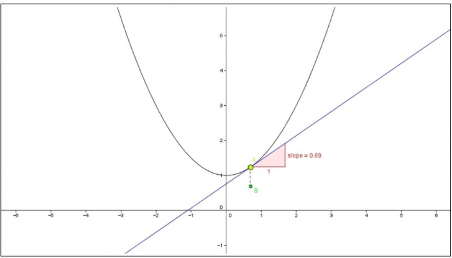

# Derivatives

A *derivative* (slope of a line) is measuring the sensitivity of a function's output with respect to a very small change in  input. In other words, it measures the *steepness* of the graph of a function.

If we want to find the derivative of the a linear function like below:

> $f(x)=3x^2$

Then, given the definition of slope is the change in $y$ divided by the change in $x$, we have the below where $h$ represents an extremely small number like $.00001$:

> $\large \partial=\frac{\Delta y}{\Delta x}=\lim\limits_{x\to0}\frac{f(x+h)-f(x)}{h}=\frac{3(x+h)^2-3x^2}{h}$

Apply the slope formula:

> $\large \partial=\frac{(3x^2+2xh+3h^2)-3x^2}{h}$

Simplify:

> $\large \partial=\frac{(3x^2+2xh+3h^2)-3x^2}{h}=\frac{2xh+3h^2}{h}=\small 2x+3h$

Next, set $h$ to $0$ (the limit of $h$ approaches $0$):

> $\partial=2x+(3\cdot0)=2x$

Therefore the slope at any point is $2x$ for the function $f(x)=3x^2$.

# Derivatives and Quadratics

For getting the derivative of a quadratic function we will need to calculate it with respect to the tangent line as shown below. Also, since quadratics are complex function and don't yield a simple straight line we only know the partial derivative $\partial$ at any given point since it is constantly changing.

> $\large\frac{\partial f(x)}{\partial x}$ or $\large\frac{\partial}{\partial x}f(x)$

