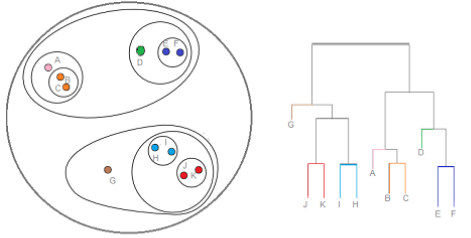

# Computational Thinking and Data Science

My notes taken from the MIT [Introduction to Computational Thinking and Data Science](https://ocw.mit.edu/courses/electrical-engineering-and-computer-science/6-0002-introduction-to-computational-thinking-and-data-science-fall-2016/) course.

## Feature Engineering

* Most critical and time consuming part of model building.
* Trial and error process.
* The choice of features influences results. 
* Answers questions like: 
  * Have new features been identified? 
  * How to incorporate them into the model? 
  * Which features should be used and which are just noise?
*  Converting raw data into a higher representation of the data through Data Preparation.
* Typically for [Unsupervised Learning](https://docs.google.com/document/d/1G92UY1q2AORvF48GTfpX8QJrajMomAr5EZdy7G3rV9Y/edit#heading=h.3as4poj), defining how to measure distance between training examples and ultimately between classifiers and new instances.
* Typically for [Unsupervised Learning](https://docs.google.com/document/d/1G92UY1q2AORvF48GTfpX8QJrajMomAr5EZdy7G3rV9Y/edit#heading=h.3as4poj), decide how to weight the relative importance of different features (dimensions) which impacts the definition of distance.

## Data Preparation Techniques.

*  **Data Cleansing** - Identify and remove or correct any missing data, invalid data, etc.
* **Imputation** - Process by which missing data is replaced with a calculated guess. For example, the mean or median values of the Feature.
* **Shuffling and Binning** - Shuffle or bin the training data so the algorithm does not learn based on the order of the data.
* **Feature Scaling** - Sometimes a needed Feature larger in range than  others. For example a person’s age could be a larger range than other feature because an age can be anywhere from 0 years to over 100 years adding too much weight or distance to those points. This leads to an underfit model. In this instance we scale the feature vectors. This is where we need to convert raw data into a higher representation of the data.
  * **Z-Scaling** - This is the standard scale in statistics where each element (feature vector) is divided by the standard deviation of each value for a feature. This is the most common practice to convert certain Features (or Dimensions).
  * **Interpolation** - Take the smallest value within the Feature set and call it 0 and the largest value in the Feature set is 1.

# Unsupervised Learning

*Unsupervised Learning* is the assignment of a set of labeled feature data (observations) into subsets called clusters so that observations in the same cluster are similar in some sense.  Clustering of data is an optimization problem where a mathematical service or algorithm is used to identify how to best separated the labeled examples. We need to identify the best clusters of Features.  However, clustering is subject to constraints to avoid overfitting. 

## Clustering Constraints

Learned models (clusters) will depend on certain constraints:

* The distance metric between examples Minkowski + Linkage
* Which Features to include (Feature Vectors)
* Constraints on the complexity of the model to avoid overfitting (each Example is its own cluster):
  * The specified number of clusters (k)
  * Complexity of the separating surface

## Measuring Distance Between Clusters

Distance between clusters is computed by identifying which features to measure distance between (*Linkage Metric*) and measuring the actual distance between the identified features using the *Minkowski* method.

### Linkage Metrics: Defining Cluster Distance

**Single-Linkage** considers the distance between clusters using the shortest distance from any member (example) of one cluster to any member of the other cluster.


**Complete-Linkage** considers the distance between clusters using the greatest distance from any member (example) of one cluster to any member of the other cluster.


**Average-Linkage** considers the distance between clusters using the average distance from any member (example) of one cluster to any member of the other cluster.


### Minkowski Metric

This is the basis for finding distances between *Features* (or *Examples*):

> $\large dist(X^{(1)}, X^{(2)}, p)=(\sum\limits^{len}_{k=1} abs(X^{(1)}_k-X^{(2)}_k)^p)^{\frac{1}{p}}$

Two different ways to use the equation. For *Euclidean Distance* (straight line between two points) use p = 2, For *Manhattan Distance* (along axises only) use p = 1.


Euclidian is mostly used. Manhattan is sometimes used when different Features (or Dimensions) are not comparable or higher dimensional data. For example, age vs. other Features that are binary in nature, such as “wears glasses”.

## K-Means Clustering

For labeled data we want to find the boundaries in Feature space that separate different classes of labeled Examples. New data assigned to class based on it’s portion of the Feature space carved out by classifier surface in which it lies.

* Look for a simple surface (e.g. best line or plane) that separates the classes or clusters.
* Look for more complex surfaces, subject to constraints, that separate classes.
* Use K nearest neighbor (voting scheme) which use majority vote to select labels.

K-Means is the most common Unsupervised clustering algorithm.

* Useful when the number of necessary clusters (k) is known.
* Faster than Hierarchical such as *Random Forests*.

Basic Logic:

1. Randomly choose k examples as initial centroids
2. For each centroid, create k clusters by assigning each example to the closest centroid.
3. Compute k new centroids by averaging examples in each cluster.
4. Continue until centroids don’t change.

### Choosing K

Different ways to choose K for K-Means clustering include:

* Have a priori knowledge about the application domain.

* Use Hierarchical clustering on a subset of data.

* Try different values of k and evaluate quality of results (dissimilarity).

  ``` best_k = kmeans(points)
  foreach(trial) {	
      C = kmeans(points)
      if(dissimilarity(C) < dissimilarity(best_k)) {		
      	best_k = C	
      }		
  }
  
  return best_k
  ```

Things to consider when choosing K:

* Results can depend on location of initial centroids
* Choosing the wrong k value can lead to inaccurate results.

Other more common ways are outlined in detail in the following sections.

#### Elbow Method

Find the point that doesn't decrease significantly with every iteration.


#### Information Theoretic Jump Method 

**_To Do_** 

#### Silhouette Method

**_To Do_** 

#### G-Means Algorithm

**_To Do_**

## Measuring Model Optimization

**Cluster Variability** is the sum of the distance between the cluster mean (centroid) and each example then square the result.

> $\large variability(c)=\sum\limits_{e\in c}distance(mean(c),e)^2$

**Model Dissimilarity** is the sum of all the cluster variabilities.

> $\large dissimilarity(C)=\sum\limits_{c\in C}variability(c)$

High model dissimilarities result in an underfit model so constraints need to be applied as “guardrails” to provide a more fit model such as fewer clusters (k) or some feature values need to be scaled. 

**NOTE:** Overfitting and underfitting are the two biggest causes for poor performance of machine learning algorithms. Ideally, you want to select a model at the sweet spot between underfitting and overfitting.

## Measuring Model Accuracy

Once you have a model you can run your test data and product a *Confusion Matrix* or *Error Matrix* which will be used to determine training errors.


The accuracy is then measured by the below. This should be done for not only the training data set but to the test data set.

> $accuracy=\frac{\mbox{true positive}+\mbox{true negative}}{\mbox{true positive}+\mbox{true negative}+\mbox{false positive}+\mbox{false negative}}$


## Other Statistical Measures

### Positive and Negative Predictive Values

**PPV** identifies how many true positives were identified for all of the examples that were positive.

> $\mbox{positive predictive value}=\frac{\mbox{true positive}}{\mbox{true positive}+\mbox{false positive}}$

**NPV** identifies how many true negatives were identified for all of the examples that were negative.

> $\mbox{negative predictive value}=\frac{\mbox{true negative }}{\mbox{true negative }+\mbox{false negative}}$

## Sensitivity and Specificity

**Sensitivity** (sometimes referred to as recall) identifies the percentage of examples that were correctly identified (true positives).

> $\mbox{sensitivity}=\frac{\mbox{true positive}}{\mbox{true positive}+\mbox{false positive}}$

**Specificity** (sometimes referred to as precision) identifies the percentage of examples that were correctly rejected (true negatives). 

> $\mbox{specificity}=\frac{\mbox{true negative }}{\mbox{true negative }+\mbox{false negative}}$

**Example:** If we know that the population of a dataset is 100 examples  and we know that 30%, or 30, are labeled as matches (positives) then the below shows that the specificity (looking at PPV) is high but the sensitivity is off (should be closer to 70/30 not 80/20). Which means there are some in cluster 1 that should be in cluster 2.

**Cluster 1:** *Size = 80 examples, PPV = 0.2902*

**Cluster 2:** *Size = 20 examples, PPV = 0.6923*

## F-Score

**_To Do_** 

## Receiver Operator Curve

There is a trade-off between **Sensitivity** and **Specificity**. The **R**eceiver **O**perator **C**urve (ROC) is useful to measure this trade-off and a nice way to see how any predictive model can distinguish between the true positives and negatives. For a perfect classifier the ROC curve will go straight up the Y axis and then along the X axis. A classifier with no power will sit on the diagonal with most classifiers falling somewhere in between.


# Supervised Learning

## Hierarchical

When given **labeled data** we need identify the mathematical service that best separates the *labeled* *examples*.

**Hierarchical Clustering** seeks to build a hierarchy of clusters.

* Useful when the number of necessary clusters (*k*) is unknown.
* Can select a number of clusters using a dendogram.Deterministic
* Flexible with respect to linkage criteria (single, complete or average).
* Slow performance (greedy and naive)

Logic:

1. Assign each example to a cluster, so that if you have N examples, you have N clusters (1 example == 1 cluster).
2. Next, find the closest (most similar) par of clusters and merge them into a single cluster thereby reducing the number of clusters.
3. Continue the process until all examples are clustered into a single cluster of size N.

The results of hierarchical clustering are usually presented in a **dendogram** as seen on the right below.



Algorithms and Libraries:

* Boosting [ [Wikipedia](https://en.wikipedia.org/wiki/Boosting_(machine_learning)) ]
* Gradient Boosting [ [Wikipedia](https://en.wikipedia.org/wiki/Gradient_boosting) ]
* XGBoost [ [GitHub](https://github.com/dmlc/xgboost) ]

## Clustering Unlabeled Data

### Supervised Learning

Standard Method:

1. Pick *k* samples from the training data as exemplars (centroids)
2. Cluster remaining samples by minimizing the distance between samples in the same cluster.
3. Put the sample in groups with closest exemplar
4. Find the *median* example in each cluster as a new exemplar
5. Repeat until no change (no new exemplars or centroids)

### Measuring Model Accuracy

Check the fitting. If underfitted then try a higher *k* value or a lower *k* value is overfitted.


## Classification

Classification is the process used to predict discrete values (labels) associated with a feature vector.

### K-Nearest Neighbors

The **k**-**nearest neighbors** algorithm (**k**-**NN or KNN**) is *non-parametric*, that is, it is not function based so there is not equation to describe it (non linear). In both cases, the input consists of the ***k*** **closest** training examples in the feature space.

Take *K* nearest examples and vote. *k* is typically an odd number so there is a majority vote. This to avoid any outliers and get a better match. You don’t want too large of a *K* otherwise you may not get actuate matches and performance would be slower.

Example: The below *X* would be classified as black, with *k = 3*. The red example is an outlier. 2 black matches vs. 1 red match means the X would be labeled as black.


Logic:

1. Assume a value for the number of nearest neighbors *K* and a prediction point *xₒ*. 
2. Identify the training observations *Nₒ* closest to the prediction point *xₒ*. 
3. Estimate *f(xₒ)* using the average of all the responses in *Nₒ*.

> $\large\hat{f}(x_0)=\frac{1}{K}\sum\limits_{x_i\in N_0}yi\cdot$

How to choose a value for k: **TODO: Need more investigation.**

* Similar to picking a *K* for **K-Means** but more similar to **Cross Validation**.
* Take training data and split it into *testing* and *training* (multiple times) and take the best *K*.
* In general, the optimal value for *K* will depend on the [bias-variance tradeoff](https://en.wikipedia.org/wiki/Bias–variance_tradeoff).
* A small value for *K* provides the most flexible fit, which will have low bias but high variance.
* This variance is due to the fact that the prediction in a given region is entirely dependent on just one observation.
* In contrast, larger values of *K* provide a smoother and less variable fit; the prediction in a region is an average of several points, and so changing one observation has a smaller effect.

Advantages:

* Learning fast, no explicit training
* No theory required
* Easy to explain method and resultsIt does not assume an explicit form for *f(X)*, providing a more flexible approach.

Disadvantages:

* Memory intensive and predictions can take a long time
* Are better algorithms than “brute force”
* No model to shed light on process that generated data
* Can be often more complex to understand and interpret
* If there is a small number of observations per predictor, then parametric methods then to work better.

Things to consider:

* Memory intensive
* Predictions can take a long time

### Logistic Regression

Logistic Regression (most preferred classification method) is used to predict the *<u>probability</u>* of an event. It is *parametric*, that is, it is function based so there is an equation to describe it (linear). In other words, the *<u>probability of what the label should be</u>*. It is analogous to *Linear Regression* is used to predict which is used to predict a coefficient value.

Advantages:

* Provides insights about variables. KNN does not tell us which predictors are important; we don’t get a table of coefficients with p-values.
* Easy to fit. One needs to estimate a small number of coefficients.
* Often easy to interpret.

Disadvantages:

* They make strong assumptions about the form of *f(X).*
* Suppose we assume a linear relationship between *X* and *Y* but the true relationship is far from linear, then the resulting model will provide a poor fit to the data, and any conclusions drawn from it will be suspect.

Logic:

1. For each feature compute a weight using *Linear Regression*
2. Add up all of the computed coefficients
3. If number is positive, or more than a given threshold (default usually being 0.5), it is a strong indicator (positive prediction).
4. If the number is negative, or less than a given threshold (default usually being 0.5), it is a strong indicator (negative prediction).
5. The larger the weights the stronger the prediction.

## Cross Validation

### Repeated Random Subsampling

* Also known as Test-Validation-Train Split
* Keeps a lot of data as unseen
* Uses a subset of test data to train which can then be used to cross validate future outcomes in more integrated tests.
* Typically 80% train data and 20% test data
* https://www.youtube.com/watch?v=P2NqrFp8usY

### Leave-One-Out -(LOOCV)

* Typically used with a small number of samples
* Computationally intensive
* Only use one data point as test sample and run training with other examples
* https://www.youtube.com/watch?v=sFO2ff-gTh0

Logic:

1. Leave one example out as a test
2. Test the example against the rest of the data
3. Repeat for all examples in the data set
4. Take the average

### K-Fold

* Randomly split the dataset into “K-Folds”
* For each “fold”, train the model and record the error.
* https://www.youtube.com/watch?v=TIgfjmp-4BA