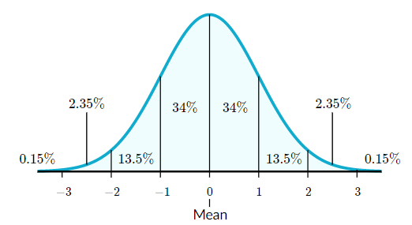

# Multivariate Linear Regression

## Hypothesis

Below is our *hypothesis* for *univariate* linear regression with a single feature value denoted by the variable $x$.

> $h_{\theta }( x) =\theta _{0} \ +\ \theta _{1} x$

For multiple features we would represent them in our equation in the form of $x_1, x_2, x_3$ all the way to $x_n$. For example, the below would be three features of $x_1$ to $x_3$.

> Features: *stock price* = $x_1$, *date sold* = $x_2$, *sale price* = $x_3$

To denote a single value in example $i$, feature $j$ we would write:

> $x^{(i)}_j$

Therefore to get the 5th feature in the 3rd example we would write it as:

> $x^{(3)}_5$

To support $n$ features the hypothesis function has to change to the following.

> $h_{\theta }( x) =\theta _{0} \ +\ \theta _1x_1+ \theta _2x_2+ \theta _3x_3+\cdot\cdot\cdot+ \theta _nx_n$

This can be written using vectors. Note, however, that $\theta_0$ and $x_0$ will be a constant of 1. This can be thought of as adding an additional 0 feature and our vectors are now *0-indexed*.

> $x=\begin{bmatrix}x_0\\x_1\\x_2\\x_3\\\cdot\\x_n\end{bmatrix}, \theta=\begin{bmatrix}\theta_0\\\theta_1\\\theta_2\\\theta_3\\\cdot\\\theta_n\end{bmatrix}$

So, our hypothesis function can be written as the below where $\theta _0x_0$ is $1\cdot1$ or 1.

> $h_{\theta }( x) =\theta _0x_0 +\theta _1x_1+ \theta _2x_2+ \theta _3x_3+\cdot\cdot\cdot+ \theta _nx_n$

In order to multiply the two vectors, $\theta$ and $x$, we need to *transpose* the theta vector which will then be labeled as $\theta^T$ which is now an (n+1) x 1 matrix or *row vector*.

> $\theta^T=\begin{bmatrix}\theta_0,\theta_1,\theta_2,\theta_3,\cdot\cdot\cdot,\theta_n\end{bmatrix}$

The function below visually illustrates our new hypothesis function.

> $h_{\theta }( x) =\begin{bmatrix}\theta_0,\theta_1,\theta_2,\theta_3,\cdot\cdot\cdot,\theta_n\end{bmatrix}\cdot\begin{bmatrix}x_0\\x_1\\x_2\\x_3\\\cdot\\x_n\end{bmatrix}$

Now, the hypothesis function can be re-written as simply:

> $h_{\theta }( x) =\theta^Tx$

## Gradient Descent

> $\large J( \theta _{0} ,\ \theta _{1},\cdot\cdot\cdot,\theta_n) =\frac{1}{2m}\sum\limits ^{m}_{i=1}\left( h_{\theta }\left( x^{( i)}\right) -y^{( i)}\right)^{2}$

> $\large J(\theta) =\frac{1}{2m}\sum\limits ^{m}_{i=1}\left( h_{\theta }\left( x^{( i)}\right) -y^{( i)}\right)^{2}$

>*repeat until convergence {* 
>
>​    $\theta_j:=\theta_j-\alpha\frac{\partial}{\partial\theta_j}J(\theta)$
>
>*} (Simultaneously updated for every $j=0$, . . ., $n$)*

>*repeat until convergence {* 
>
>​    $\theta_j:=\theta_j-\alpha\frac{1}{m}\sum\limits ^{m}_{i=1}\left( h_{\theta }\left( x^{(i)}\right) -y^{( i)}\right)x^{(i)}_j$
>
>*} (Simultaneously updated for every $j=0$, . . ., $n$)*

## Feature Scaling

Having features that are not scale appropriately can cause Gradient Descent to take a longer time minimizing the cost function $J(\theta)$. The ideal range for any feature is between -1 and 1 such that $-1\leq x \leq1 $. This is called a *normal distribution*. If we have a feature that is too large or too small we will need to scale them to optimize Gradient Descent.

Normal distributions have the following features:

* symmetric bell shape
* mean and median are equal; both located at the center of the distribution
* $\approx68\%$ of the data falls within 1 standard deviation of the mean
* $\approx95\%$ of the data falls within 2 standard deviations of the mean
* $\approx99.7\%$ of the data falls within 3 standard deviations of the mean

*Z-Scaling* is used to scale features up or down to a normal distribution range of $-1\leq x \leq1$ where we take the sum of the features ($x_i$), subtract the mean ($\mu_i$)  and then divide by the standard deviation ($\sigma_i$). A *Z-Score* that has a range up to $-3\leq x \leq3$ is still considered to be within the normal range.

> $\large\hat{x} = \huge\frac{x_i-\mu_i}{\sigma_i}$